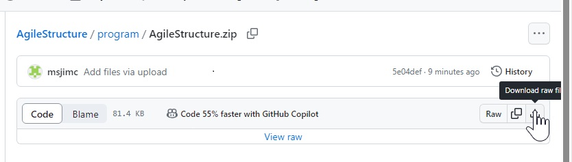
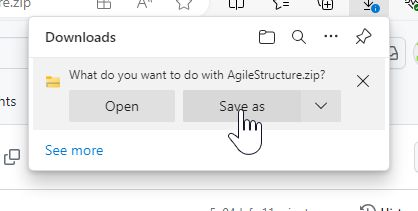
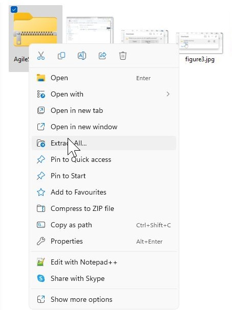
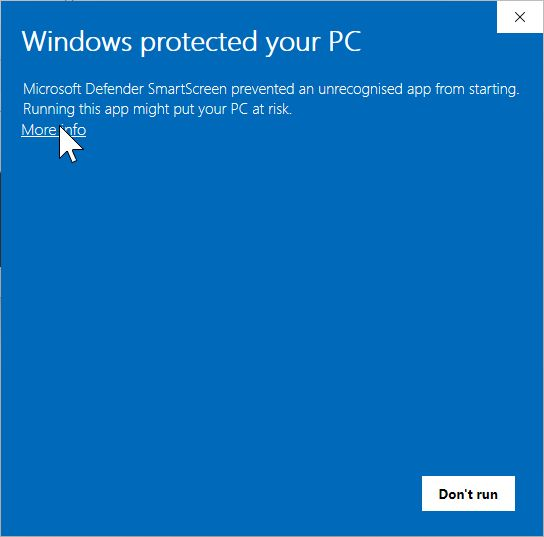
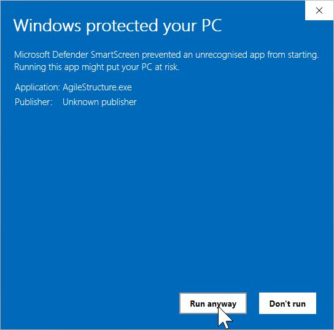
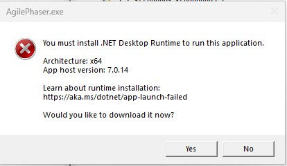

# Download

## Download the whole repository

It is possible to download the whole repository by clicking on the green '<> Code' button on the main repository page. This will download the whole repository which is intended for user that may wish to modify the code or build the program with non-default build parameters. If you prefer to just download the program, follow the steps in the next section.

---

## Downloading just the program the zip file

This folder contains the precompiled files needed to run the program on 32 or 64 bit systems, stored in two zip files. Each zip file contains 2 *.dlls, 2 *.json and a *.exe file. To run the program, download and extract and then double click on the TranGBViewer.exe. Due to heightened security by some organisations' IT departments, it may not be possible to simply download and run a program. This may be overcome by moving the application out of the download folder to a folder on the PC's hard drive, not a network drive or one shared with OneDrive for example. 

<b>Note: the images refer to Agilestructure, but the process is the same for TranGBViewer</b>

First, click on the program file (TranGBViewer.zip in the table above), which will take you to a new page. In the upper right-hand corner, click on the icon of a tray with an arrow pointing to it (Figure 1). This will then start the download, which will ultimately prompt you to either save it or open the zip file (Figure 2).

Figure 1

Click on the "Save as" button (Figure 2).

Figure 2

Once downloaded, go to the zip file and extract it, saving the files to the desired location (Figure 3).

Figure 3

When you double-click on the TranGBViewer.exe file, you'll get a warning message: click on the 'Run  anyway' option (Figure 4)

Figure 4

And finally, click on the 'Run  anyway' option and the program should start (Figure 5).

Figure 5

# Running TranGBViewer

To run TranGBViewer, double-click on the file in File Explorer, and it should start. If it doesn't, first make sure that all three files are in the same folder (TranGBViewer.exe, TranGBViewer.dll, Newtonsoft.json and TranGBViewer.runtimeconfig.json). If you get an error message such as the one in Figure 6, go to the [.NET download page](https://dotnet.microsoft.com/en-us/download/dotnet/7.0) and select the appropriate ".NET Desktop Runtime". There are a number of options; make sure you choose the desktop version.

Figure 6