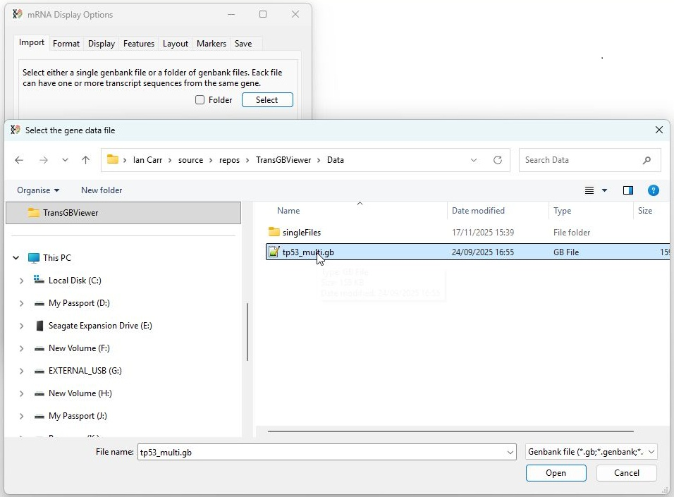
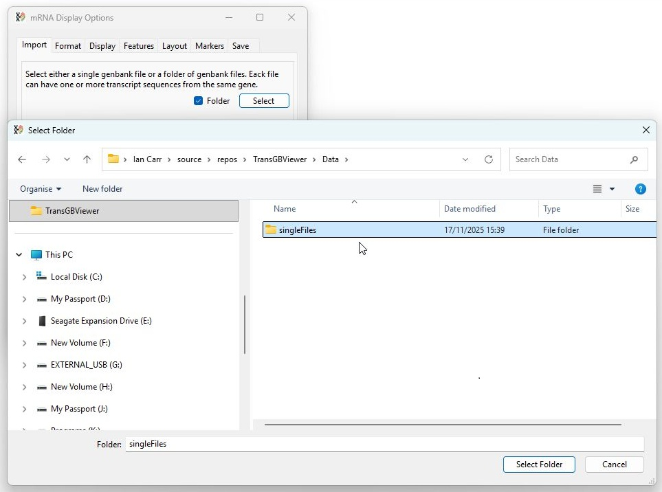
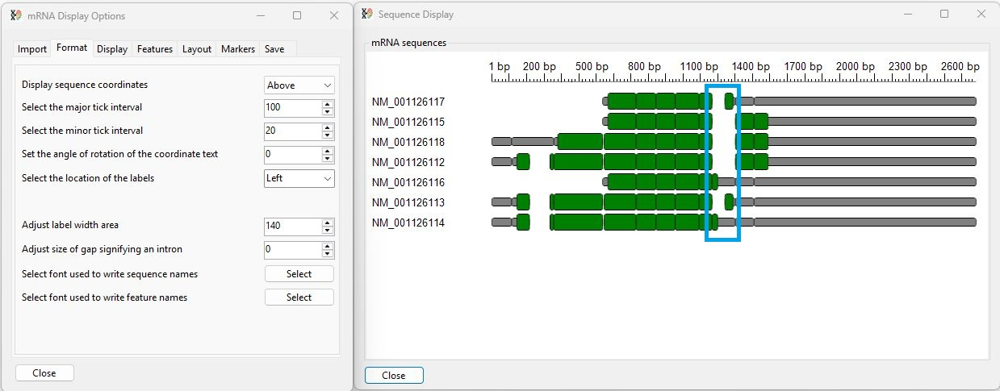

# Importing sequence data

TransGBViewer is designed to display linear mRNA sequence data downloaded from the NCBI website in the GenBank format using the *.gb or *.genbank file extensions. It is possible to import a single file containing multiple entries or a folder of files that contain one or more entries. It is expected that all the sequences relate to the same gene in a single species.

⚠️ <b>Important note: Since the GenBank files do not reference each other, sequence similarities are determined based on homology. Consequently, it is important that the sequences are highly homologous. Only sequences from the same species can be used and ideally those submitted by the same group or by GenBank's own automated submission system used to annotated reference genomes.</b> 

## Data selection

The first tab page of the ___mRNA Display Options___ window allows you to select the GenBank formatted sequence data. Pressing the __Select__ button with the __Folder__ option unticked prompts you to select a single file containing multiple entries (Figure 1)

Figure 1: Pressing the __Select__ button prompts you to select a single file, if the __Folder__ option is unchecked.

Pressing the __Select__ button with the __Folder__ option ticked prompts you to select a folder of GenBank formatted files each containing one or more entries (Figure 2).

Figure 2: Pressing the __Select__ button with __Folder__ option checked prompts you to select a folder of files.

## Image description

Once data has been imported, the sequences are displayed in the  ___Sequence Display___ window (Figure 3).

Figure 3:

The sequences of each transcript are used to create a consensus sequence of the gene's transcribed sequences. Initially, a transcript's non-coding sequences are drawn as narrow grey rectangles, while coding sequences are drawn as taller green boxes. Sequences common to a number of transcripts are drawn above each other allowing common sequences to be identified. If a transcript contains an alternatively spliced exon that is located between two consecutive exons in a transcript a gap is drawn. 

The base pair coordinates of the consensus sequence are displayed above the transcripts, while the labels identifying each transcript are drawn to the left.