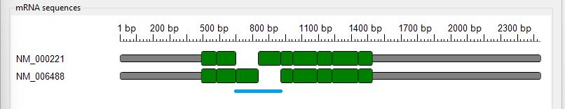
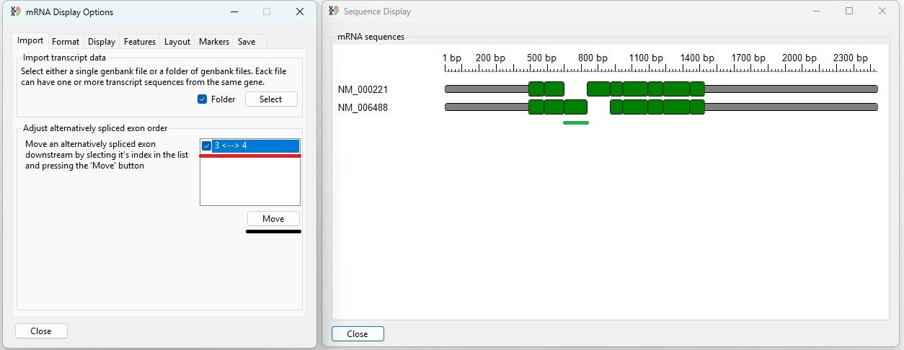
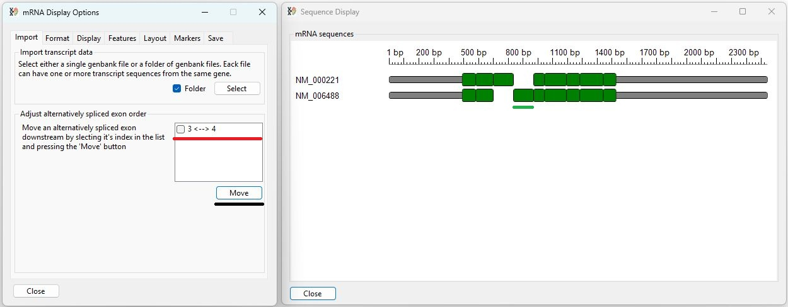

## List of contents
- [Importing sequence data](DATA.md#importing-sequence-data)
    - [Important points](DATA.md#important-points)
  - [Data selection](DATA.md#data-selection)
  - [Importing sequences lacking exon boundary data](#importing-sequences-lacking-exon-boundary-data)
  - [Image description](DATA.md#image-description)
  - [Adjusting the location of alternatively spliced exons](DATA.md#adjusting-the-location-of-alternatively-spliced-exons)
 
 ---

# Importing sequence data

- ___TransGBViewer___ is designed to display linear mRNA sequence data downloaded from the NCBI website in the GenBank format using the *.gb or *.genbank file extensions. It is possible to import a single file containing multiple entries or a folder of files each containing one or more entries. All sequences should relate to the same gene in a single species.
- ___TransGBViewer___ is designed to obtain exon boundary data from the GenBank file, generally speaking entires for accession ID's starting with **NM_** have this data, but other types of sequence such as those linked to ID's starting **MW** may not. Consequently, you should try to import entires with **NM_** IDs. If a set of imported sequences contains entires that lack exon boundary locations __TransGBViewer__ will attempt to identify exons, but this process is not robust and consecutive exons may appear as a single exon. For __TransGBViewer__ to process sequences lacking exon data, at least one of the entires must have this data.

### Important points
 Since the GenBank files do not reference each other, sequence similarities are determined based on homology. Consequently, it is important that the sequences are highly homologous. Only sequences from the same species should be used, and ideally those submitted by the same group or by GenBank's own automated submission system used to annotate reference genomes.

## Data selection

The first tab page of the ___mRNA Display Options___ window allows you to select the GenBank-formatted sequence data. Pressing the __Select__ button with the __Folder__ option unticked prompts you to select a single file containing multiple entries (Figure 1).

Figure 1: Pressing the __Select__ button prompts you to select a single file if the __Folder__ option is unchecked.

---

Pressing the __Select__ button with the __Folder__ option ticked prompts you to select a folder of GenBank formatted files each containing one or more entries (Figure 2).

Figure 2: Pressing the __Select__ button with the __Folder__ option checked prompts you to select a folder of files.

---

## Importing sequences lacking exon boundary data

If one or more entires lack exon data, its name will be displayed in a message box asking if you wish to attempt to identify exons in these sequences. If you select __No__, these sequences will not be displayed, but their names/accession IDs will appear in the drop-down lists. Ideally, you will remove these sequences and reimport the data set.

## Image description

Once data has been imported, the sequences are displayed in the  ___Sequence Display___ window (Figure 3).

Figure 3:

---

The sequences of each transcript are used to create a consensus sequence of the gene's transcribed sequences. Initially, a transcript's non-coding sequences are drawn as narrow grey rectangles, while coding sequences are drawn as taller green boxes. Sequences common to a number of transcripts are drawn above each other, allowing common sequences to be identified. If one transcript contains an alternatively spliced exon that is absent from a second transcript, the second transcript is drawn with a gap (blue box in Figure 3). 

Initially, the base pair coordinates of the consensus sequence are displayed above the transcripts, while the labels identifying each transcript are drawn to the left.

## Adjusting the location of alternatively spliced exons

The order of the exons in the displayed image is determined by both their order in the GenBank entires and the order in which the Genbank entires are processed. However, while the exons will always be arranged in an order consistent with the imported data, this may not always reflect their order on the chromosome. For instance, there are two important ketohexokinase (KHK) transcripts: variant a (NM_000221) and variant b (NM_006488) (see Genbank files [here](../Data/khk/)). The third exon of each transcript is alternatively spliced, with each exon only present in one transcript (blue line in Figure 4). Consequently, the order in the final display is ambiguous and may not reflect the chromosomal order of the exons. 

Figure 4: The position of the third exon of both KHK variants can be switched without affecting the exon order of each transcript.

---

The presence of ambiguously placed exons is displayed in the checkbox list in the __Adjust alternatively spliced exon order__ panel: in this instance only one ambiguity exists (red line in Figures 5a and 5b). To swap the location of the alternatively spliced exons, tick the box at the side of the relevant entry and press the __Move__ button (black line in Figure 4). This should then switch the location of the ambiguous exons in the display (green lines in Figures 5a and 5b). 

Figure 5a:

---

Figure 3b:

---

Figure 5: Selecting an ambiguously ordered exon pair in the checkbox list (red lines) and pressing the __Move__ button (black lines) switches the order of the exons (green lines).

Once the order has been adjusted the exon order is re-examined, and the location of ambiguities is detected, and the checkbox list is repopulated. Since this case is relatively simple, no noticeable change occurs, but this repopulation of the checkbox list means that only one pair of exons can be switched at a time.  

