## List of contents
- [Adjusting how sequences are displayed](DISPLAY.md#adjusting-how-sequences-are-displayed)
  - [Changing the colours used to draw the sequences](DISPLAY.md#changing-the-colours-used-to-draw-the-sequences)
  - [Selecting a region to view](DISPLAY.md#selecting-a-region-to-view)
    - [Start the base pair interval value at 1 when zooming in](DISPLAY.md#start-the-base-pair-interval-value-at-1-when-zooming-in)
  - [Highlighting coding sequences](DISPLAY.md#highlighting-coding-sequences)
  - [Drawing exons as boxes with or without rounded corners](DISPLAY.md#drawing-exons-as-boxes-with-or-without-rounded-corners)
  - [Highlight coding and non-coding sequences by reducing the height of the non-coding sequence boxes](DISPLAY.md#highlight-coding-and-non-coding-sequences-by-reducing-the-height-of-the-non-coding-sequence-boxes)
  - [Highlighting out-of-frame coding sequences](DISPLAY.md#highlighting-out-of-frame-coding-sequences)
  - [Highlighting a transcript's exon splice sites](DISPLAY.md#highlighting-a-transcripts-exon-splice-sites)
  - [Changing the colour of the lines used to highlight the donor and/or acceptor splice sites](DISPLAY.md#changing-the-colour-of-the-lines-used-to-highlight-the-donor-andor-acceptor-splice-sites)
  - [Highlighting a transcript's translational start and stop sites](DISPLAY.md#highlighting-a-transcripts-translational-start-and-stop-sites)
  - [Changing the colour of the lines used to highlight the translational start and stop sites](DISPLAY.md#changing-the-colour-of-the-lines-used-to-highlight-the-translational-start-and-stop-sites)
  - [Adjusting the thickness of the lines showing splice sites and translational start and stop sites](DISPLAY.md#adjusting-the-thickness-of-the-lines-showing-splice-sites-and-translational-start-and-stop-sites)
 
 ---

# Adjusting how sequences are displayed

The __Display__ tab of the ___mRNA Display Options___ window provides controls for configuring how sequences are shown (Figure 1).

## Changing the colours used to draw the sequences

By default, coding sequences are drawn as green blocks and non-coding regions are drawn as grey rectangles; these colours can be modified using the __Sequence colour selection__ window, which is opened by pressing the __Select__ button at the top of the __Display__ tab (Figure 2).

Figure 2: Pressing the __Select__ button opens the __Sequence colour selection__ window.

---

To change the colour of one or more transcripts, first check the name of the transcripts in the checklist on the right-hand side (blue box in Figure 3), and then select whether the change will affect the coding, non-coding or both types of sequence using the __Coding__ and __Non-coding__ checkboxes on the left (red box in Figure 3).

Figure 3: To change the transcript colour scheme, first check the names of the transcripts you wish to modify (blue box). Then select whether coding or non-coding sequences will be changed (black box).

---

Once one transcript and the type of sequence to change have been selected, the __Select__ button will become active (grey line in Figure 3). Pressing the __Select__ button will then display a colour selection window. If the __By Name__ option is selected, the __Select sequence colour__ window is displayed (Figure 4a). If the __Colour picker__ option is selected, the standard Windows __Colour Picker dialog__ window opens (Figure 4b).

The use of the __Select colour by name dialog__ and __Windows colour picker dialog__ boxes is described here: 

- [Using the Select colour by name dialog box](SequenceColour.md)
- [Using the Windows colour picker dialog box](ColourPickerDialog.md)

Once the colour has been selected, pressing the __Accept__ button will accept the modifications and redraw the image (Figure 4), while pressing __Cancel__ will discard the changes.

Figure 4: Pressing the __Accept__ button will close the window, save the new scheme and redraw the image.

---

## Selecting a region to view

The __Display__ tab contains two number boxes that allow you to select a region to view. By default all sequences are visible (Figure 5a), but by selecting a different start and/or end point, it is possible to expand the image to show a region of interest in greater detail (Figure 5b). 

Figure 5a: By default all sequences are visible, with the values in the __Limit region displayed__ number boxes set to 1 and the consensus sequence's length (blue box). 

---

Figure 5b: Adjusting the values in the __Limit region displayed__ number boxes allows a specific region to be viewed (blue box).

---

### Start the base pair interval value at 1 when zooming in

In Figure 5b a region of 148 to 1588 was selected, and the base pair position label started at 148 bp. Checking the __Start at 1 bp__ option (blue box in Figure 6) renumbers the coordinates to start at 1 bp (red line in Figure 6).

Figure 6: Checking the __Start at 1 bp__ option (blue line) causes the interval label to start at "1 bp" (red line).

---

## Highlighting coding sequences

By default, coding sequences are drawn in as different coloured rectangles overlaying the non-coding sequences; however, unchecking the __Show__ checkbox (blue line in Figure 7) to the right of the __Highlight coding sequences__ label will hide the coding sequence rectangles.

Figure 7: Unchecking the __Show__ option (blue line) will stop the coding sequence from being highlighted.

---

## Drawing exons as boxes with or without rounded corners

By default, the boxes are drawn with rounded corners (red circle in Figure 8a); unchecking the __Round__ checkbox (blue line in Figures 8a and 8b) to the right of the __Round the corners of the exons__ label will redraw the image with square corners (red circle in Figure 8b).

Figure 8a: By default all sequences are drawn with rounded corners (red circle). 

---

Figure 8b: Unchecking the __Round__ checkbox (blue line) redraws the images with square corners (red circle in Figure 8b).

---

## Highlight coding and non-coding sequences by reducing the height of the non-coding sequence boxes

As well as drawing the coding and non-coding sequences in different colours, the coding sequences can be highlighted by reducing the height of the rectangles corresponding to the non-coding sequences. Unchecking the __Reduce__ checkbox to the right of the __Reduce the height of non-coding sequences__ will redraw the image with all the rectangles drawn with the same height (Figures 9a and 9b).

Figure 9a: By default all sequences are drawn with non-coding sequences represented by narrow rectangles (red box). 

---

Figure 9b: Unchecking the __Reduce__ checkbox (blue line) redraws the image with all the boxes the same height (red box in Figure 9b).

---

## Highlighting out-of-frame coding sequences

<b>Note:</b> The images in Figures 10b and 10c were created using a modified GenBank file in which 1 and 2 bases were added to the position start codon in NM_001126117 and NM_001126115 respectively. For the transcript NM_001126118, the position of the 5th exon was moved 1 base pair upstream to create a frame shift for just that exon.

By default, it is only possible to see which sequences are shared between different transcripts. However, it's possible that the use of an alternative start site or  alternative splicing may lead to local or global changes in the phase of the open reading frames. Due to the size of the image compared to the length of the transcripts, small but significant differences are not readily apparent; consequently, it is possible to select a transcript and compare the reading frame of its open reading frame to that of the other transcripts. 

To select a transcript to whose open reading frame the other open reading frames are compared, select its GenBank ID from the dropdown list to the right of the __Highlight sequences in frame with__ label (blue box in Figure 10a). Once selected, an __*__ will appear by the transcript's display name in the image (black line in Figure 10a), and the open reading frames of the other transcripts will become colour-coded. Only the equivalent coding sequences in the other transcripts will be modified. 

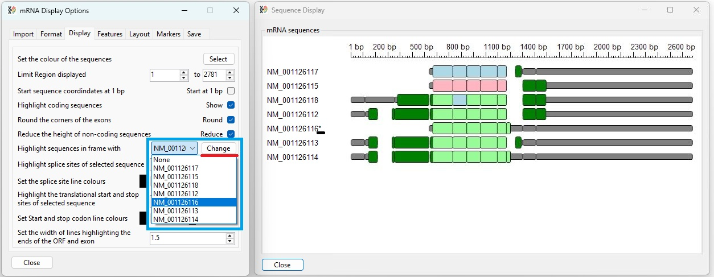

Figure 10a: The transcript ID NM_001126118 was selected from the dropdown list (blue box). 

---

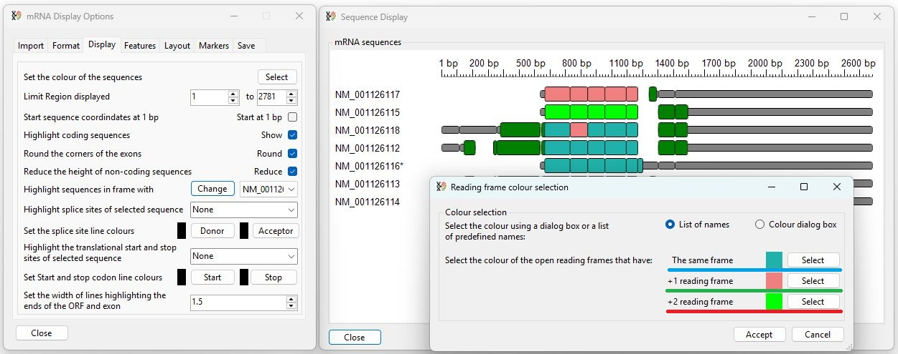

Figure 10b: Unchecking the __Reduce__ checkbox (blue line) redraws the image with all the boxes the same height (red box in Figure 9b).

---

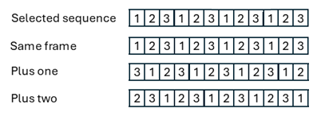

Figure 10c: Comparison of the codon usage between a selected sequence and three identical sequences in which the reading frame has been transposed 0, 1 and 2 bases upstream.

---

The colour of the coding sequences is determined by the offset between its codon usage and the selected transcript's codon usage, as shown in Figure 10c. The colours used to indicate the reading frames' phase can be modified by pressing the __Change__ button. Pressing this button will open the __Reading frame colour selection__ window (Figure 10b). Pressing the appropriate __Select__ button will allow you to select a colour using either the colour's Windows internal colour name or the Windows __Color Picker__ dialog box as described below: 

- [Using the Select colour by name dialog box](SequenceColour.md)
- [Using the Windows colour picker dialog box](ColourPickerDialog.md)

Once the colour(s) has been selected, pressing the __Accept__ button will accept the modifications and redraw the image (Figure 10b), while pressing __Cancel__ will discard the changes.

## Highlighting a transcript's exon splice sites

Transcripts may share a common exon but differ functionally by utilising alternative splice sites within that exon. To aid the visualisation of these situations, it is possible to highlight exon boundaries for one or all transcripts using the __Highlight splice sites of selected sequence__ option (Figure 11). When a transcript is selected from the dropdown list (blue line in Figure 11), its splice sites are highlighted as a series of vertical dotted lines that span the entire height of the image (excluding the base pair position). 

<b>Note:</b> Visualisation of alternative splice sites is aided by inserting a small gap at the site of an intron ([described here](../Guide/FORMAT.md#adjust-size-of-gap-signifying-an-intron-option)), and the image is zoomed in to the splice site ([described here](../Guide/DISPLAY.md#selecting-a-region-to-view)).

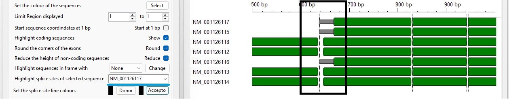

Figure 11: Selecting a transcript's name from the dropdown list box (blue line) to the right of the __Highlight splice sites of selected sequence__ label causes the splice sites to be highlighted as a series of vertical dotted lines that allow the use of alternative splice sites to be visualised (black box). 

---

## Changing the colour of the lines used to highlight the donor and/or acceptor splice sites

By default, the lines highlighting the splice sites are black; however, their colours can be changed by pressing the appropriate __Donor__ or __Acceptor__ button (blue line in Figure 12a). This will display a window called either  __Select the donor line colour__ or __Select the acceptor line colour__. This window in turn allow a colour to be selected by either its Windows system name if the __List of names__ option is selected (black line in Figure 12a) or using the Windows __colour picker dialog__ window if the __Colour dialod box__  option is selected (green line in Figure 12) when the __Colour__ button is pressed (red line in Figure 12).

- [Using the Select colour by name dialog](equenceColour.md)
- [Using the Windows colour picker dialog](ColourPickerDialog.md)

The new colour will then be displayed next to the __Colour__ button. Pressing the __Accept__ button will then accept the changes and modify the blocks of colour next to the __Donor__ or __Acceptor__ buttons (blue lines in Figure 12b) and the image (black box in Figure 12b).

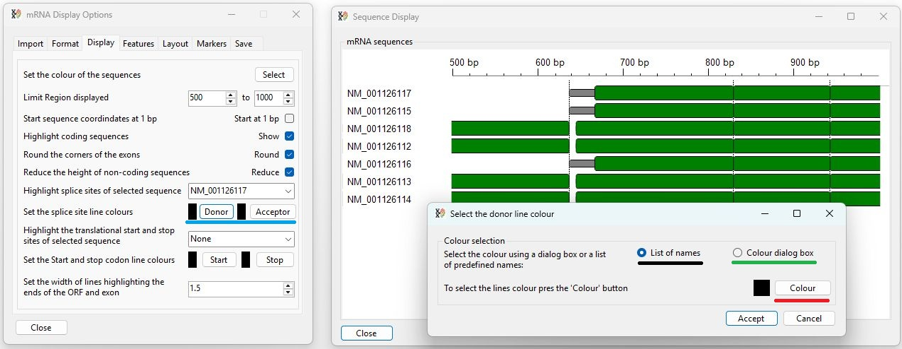

Figure 12a: The colour of the lines used to highlight splice sites can be changed by pressing the __Donor__ or __Acceptor__ button (blue line) and selecting the colour using the displayed dialog box.

---

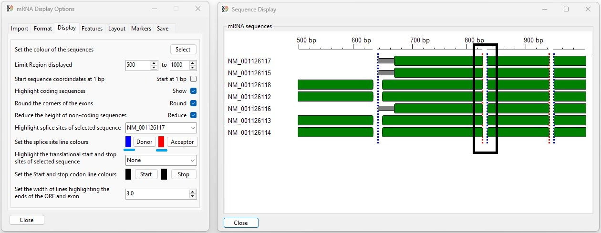

Figure 12b: Once changed, the colours of the acceptor and donor lines are shown next to the appropriate button (blue lines), and the lines are now colour-coded (black box).

---

## Highlighting a transcript's translational start and stop sites

A gene's transcripts may utilise different translational start and stop sites; to aid their visualisation,  it is possible to highlight the start and stop sites of one or all of the transcripts using the __Highlight the translational start and stop sites of selected sequence__ option (blue line in Figure 13). When a transcript is selected from the dropdown list its translational start and stop sites are highlighted as a pair of vertical dotted lines that span the entire height of the image (excluding the base pair position label). 

<b>Note:</b> Visualisation of translational start and stop sites is aided by zooming in to the splice site ([described here](../Guide/DISPLAY.md#selecting-a-region-to-view)).

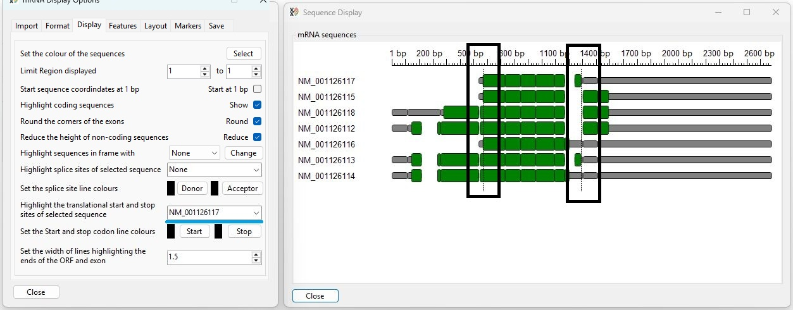

Figure 13: Selecting a transcript's name from the dropdown list box (blue line) to the right of the __Highlight splice sites of selected sequence__ label causes the start and stop sites to be shown as a series of vertical dotted lines that allow the use of alternative translation start and stop sites to be visualised (black boxes). 

---

## Changing the colour of the lines used to highlight the translational start and stop sites

By default, the lines highlighting the translational start and stop are black; however, their colours can be changed by pressing the appropriate __Start__ or __Stop__ button (blue line in Figure 14a). This will display a window called either the __Select the start codon line colour__ or the __Select the stop codon line colour__. This window allows a colour to be selected by either its Windows system name if the __List of names__ option is selected (black line in Figure 14a) or with the Windows __colour picker dialog__ window if the __Colour dialog box__ option is selected (green line in Figure 14a) and the __Colour__ button is pressed (red line in Figure 14a).

- [Using the Select colour by name dialog](equenceColour.md)
- [Using the Windows colour picker dialog](ColourPickerDialog.md)

The new colour will then be displayed next to the __Colour__ button. Pressing the __Accept__ button will close the window, change the coloured square next to the __Start__ or __Stop__ buttons (blue lines in Figure 14b), and redraw the image (black box in Figure 14b).

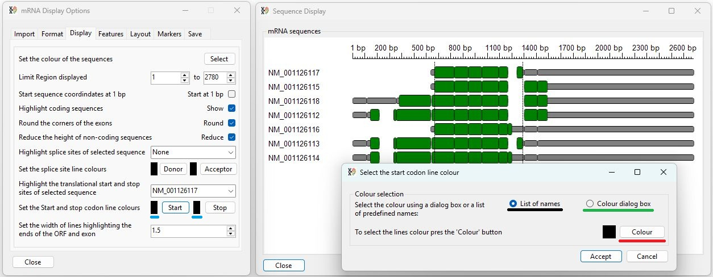

Figure 14a: The colour of the lines used to highlight translational start and stop sites can be changed by pressing the __Start__ or __Stop__ button (blue line) and selecting the colour using the displayed dialog box.

---

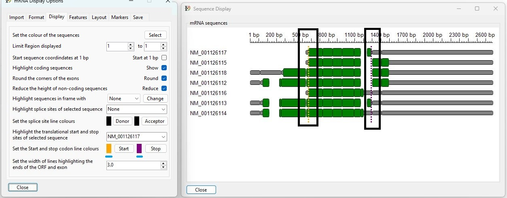

Figure 14b:  Once changed, the colour of the start and stop lines is shown next to the appropriate button (blue lines), and the lines' colours are changed (black boxes).

---

## Adjusting the thickness of the lines showing splice sites and translational start and stop sites

By default, the lines showing the splice sites and translational start and stop sites are 1.5 pixels wide (on a 96 DPI image). While this thickness is easily seen, it may be difficult to identify the lines' colour. Consequently, it's possible to adjust the line thickness from 0.5 (Figure 15a) to 3 pixels (Figure 15b) (at 96 DPI) using the line thickness control (blue line in Figures 15a and 15b). 

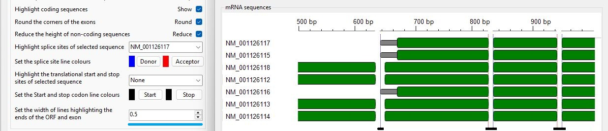

Figure 15a: Setting the value of the number control at the bottom of the window (blue line) to 0.5 draws the lines with a width of 0.5 pixels when drawn at 96 DPI (black lines).

---

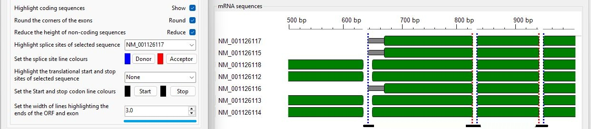

Figure 15b: Setting the value of the number control at the bottom of the window (blue line) to 3.0 draws the lines with a width of 3.0 pixels when drawn at 96 DPI (black lines).
 
---