# Adjusting how sequences are displayed

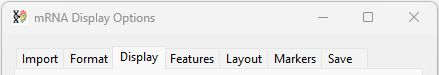

The __Display__ tab of the ___mRNA Display Options___ window provides controls for configuring how sequences are shown (Figure 1).

## Changing the colours used to draw the sequences

By default, coding sequences are drawn as green blocks and non-coding regions are drawn as grey rectangles, these colours can be modified using the __Sequence colour selection__ window which is opened by pressing the __Select__ button at the top of the __Display__ tab (Figure 2)

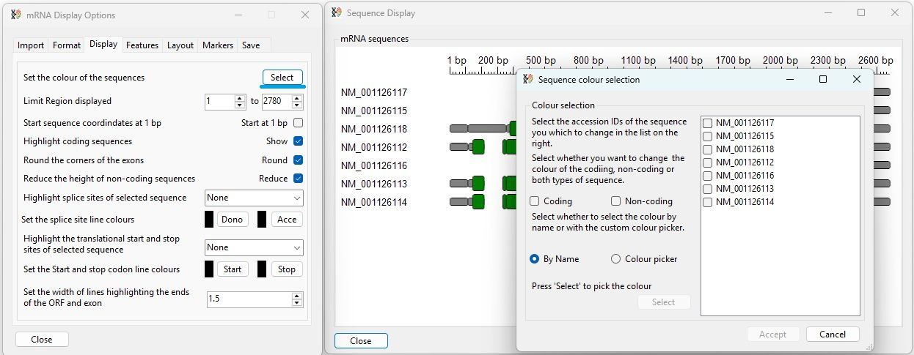

Figure 2: Pressing the __Select__ button opens the __Sequence colour selection__ window.

To change the colour of one or more transcripts, first check the name of the transcripts in the check list on the right hand side (Blue box in Figure 3) and then select whether the change will affect the coding, non-coding or both types of sequence using the __Coding__ and __Non-coding__ check boxes on the left (red box in Figure 3)

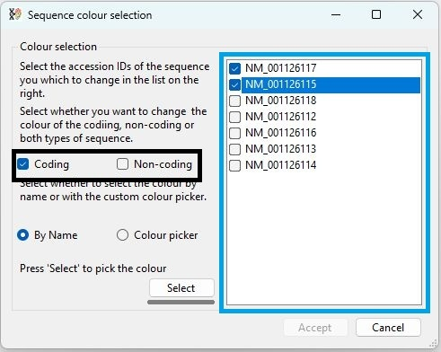

Figure 3: To change the transcript colour scheme, first select the transcripts you wish to modify (blue box). Next select whether coding or non-coding sequences will be changed (black box).

Once one transcripts and type of sequence of sequence have been selected the __Select__ button will be come active (grey light Figure 3). Pressing the __Select__ button will then display a colour selection window. If the __By Name__ option is selected the __Select sequence colour__ window is displayed (Figure 4a). If the __Colour picker__ option is selected the standard Windows __Colour Picker dialog__ window opens (Figure 4b).

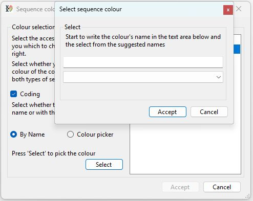

Figure 4: Pressing the __Select__ button when the __By Name__ option is selected displays the __Select sequence colour__ window appears

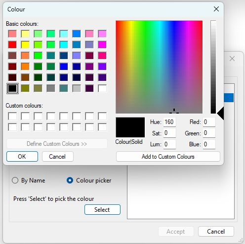

Figure 4: Pressing the __Select__ button when the __Colour picker__ option is selected displays the standard Windows __Colour Picker dialog__ window opens

### Using the elect sequence colour window

The __Select sequence colour__ window contains a blank text area and a dropdown list that contains all the standard Windows colours. The colour's names displayed are the stored as Windows colour variable names and as such use the American English spelling and contain no spaces. 

A colour can be select by either selecting the colour from the items in the drop down list or by typing its name in the upper text area. As you type, available names will be suggested and accepting one will select the relevant colour in the drop down list (Figure 5a and 5b) and it will also be displayed a coloured rectangle below the drop down list.

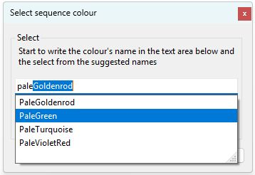

Figure 5a: Colour names are suggested as a name is entered in the upper text area. 

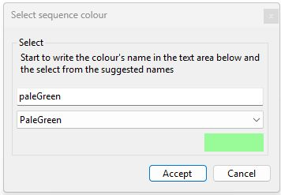

Figure 5: Once selected the name will appear in the dropdown list and a rectangle below the drop down list will display the selected colour.

Pressing the __Accept__ button will save the colour selection and close the window. Press int eh __Cancel__ button will discard the selection.

### Using the Windows Colour Picker dialog window

There are to ways to select a colour using the Colour Picker dialog, the left hand side consists of a grid with each cell representing a different colour (blue box in Figure 6a). To select on of these, click on its cell press __OK__ (black line in Figure 6a). Alternately, on the right hand side is a picture box (blue box in Figure 6b) displaying a 'rainbow', mouse click on this image to select the colour drawn at the tip of the cursor and then set the colour's brightness using the slide bar (Green box in Figure 6b) to the right of the picture box. The selected colour will then appear in the box (red box in Figure 6b) just below the picture box. To select this colour press the __Add to Custom Colours__ button (black line in Figure 6b) and then press the __OK__ button (Grey line in Figure 6b).

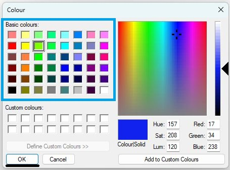

Figure 5a: Clicking on a colour in the grid (blue box) and then pressing __OK__ (black line) will select a predefined colour. 

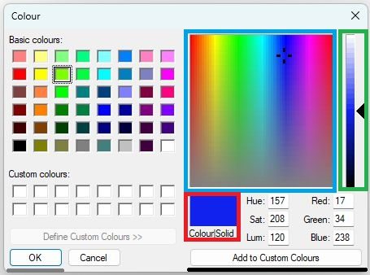

Figure 6: To select a custom colour mouse click on the rainbow image (blue box) and then adjust its brightness with using the gradient slider (green box). The selected colour will appear in the area above the __Colour Solid__ text (Red box). Pressing the __Add to Custom Colours__ button (black line) and then the __OK__ button (grey line) will accept the colour.

Pressing the __Accept___ button will accept the modifications and redraw the the image (Figure 7), while pressing __Cancel__ will discard the changes.

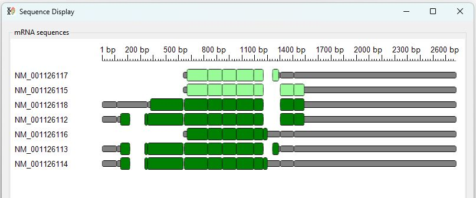

Figure 7: Pressing the __Accept__ button will close the window, save the new scheme and redraw the image.

## Selecting a region to view

The __Display__ tab contains two number boxes that allow you to select a region view. By default all sequences are visible (Figure 8a), but by selecting a new start and end point it is possible to expand the image to show a region of interest (Figure 8b). 

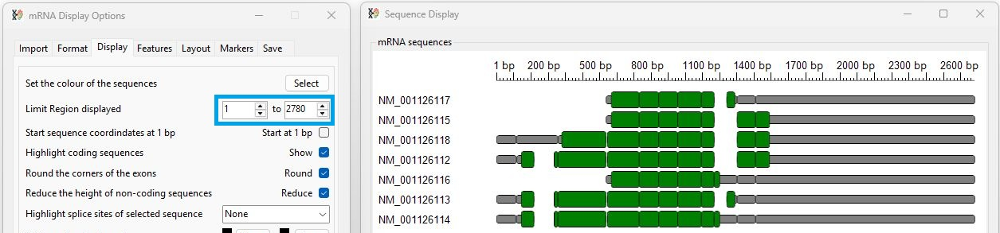

Figure 8a: By default all sequences are visible, with the values in the __Limit region displayed__ number boxes set to 1 and the consensus sequence's length (blue box). 

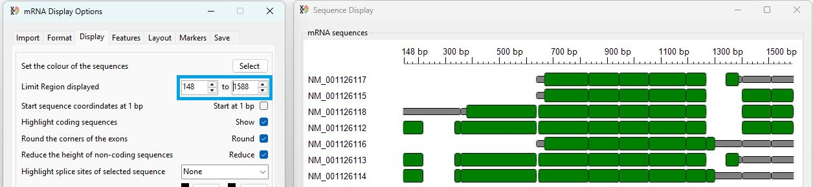

Figure 8b: Adjusting the values in the __Limit region displayed__ number boxes allows a specific region to be viewed (blue box).

### Set the base pair interval value to start at 1 when zooming in

In Figure 8b a region of 148 to 1588 was select and the base pair position label started at 148 bp. Checking the __Start at 1bp__ option (blue box in Figure 9), renumbers the coordinates to start at 1 bp (red line in Figure 9).

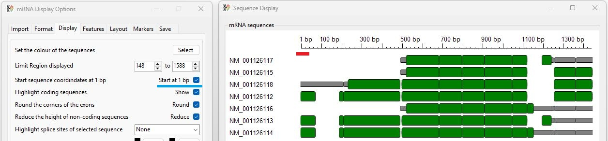

Figure 9: Checking the __Start at 1bp__ option (blue line) renumber the base pair position axis (red line)

## Highlighting coding sequences

By default coding sequences are drawn in as different coloured rectangles overlaying the non-coding sequences, however, unchecking the __Show__ check box (blue line in Figure 10) to the right of the __Highlight coding sequences__ label will hide the coding sequence rectangles.

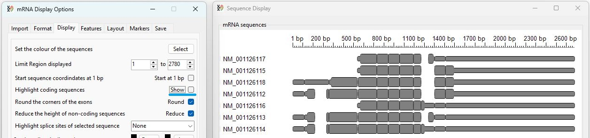

Figure 10: Unchecking the __Show__ option (blue line) will stop the coding sequence been highlighted.

## Drawing exons as boxes with or without rounded corners

By default, the boxes are drawn with rounded corners (red circle in Figure 11a), unchecking the __Round__ check box (blue line in Figure 11 a and b) to the right of the __Round the corners of the exons__ label will redraw the image without rounded corners (red circle in Figure 11b).

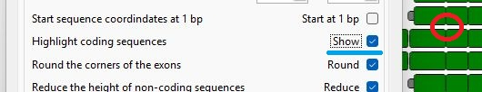

Figure 11a: By default all sequences are drawn with rounded corners (red circle). 

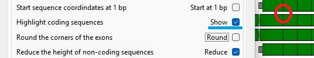

Figure 11b: Unchecking the the __Round__ check box (blue line) redraws the images with square corners (red circle in Figure 11b).

## Highlight coding and non-coding sequences by reducing the height of the non-coding sequence boxes

As well as drawing the coding and non-coding sequences in different colours, coding sequences can be highlighted by reducing the height of the rectangles representing the non-coding sequences. Unchecking the __Reduce__ check box to the right of the __Reduce the height of non-coding sequences__ will redraw the image with all the rectangles drawn with the same height (Figure 12a and 12b).

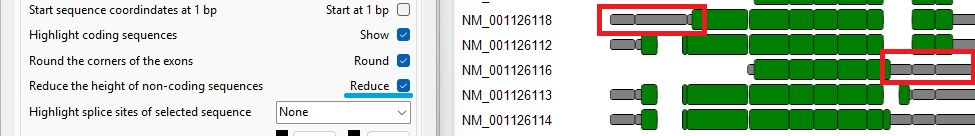

Figure 12a: By default all sequences are drawn with non-coding sequence represented by narrow rectangles (red box). 

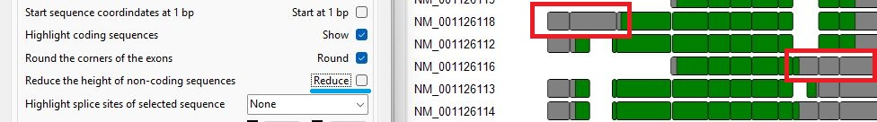

Figure 12b: Unchecking the the __Reduc__ check box (blue line) redraws the images with all the boxes the same height (red box in Figure 12b).

