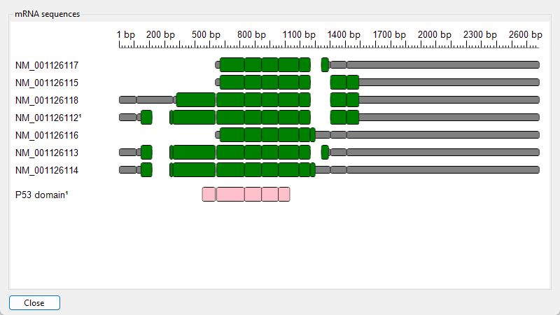

# Adding metadata to the displayed

The __features__ tab of the ___mRNA Display Options___ window provides controls for selection and display of sequence domains and motifs in the displayed sequences (Figure 1).

---

The generation of multiple alternatively spliced transcripts from a single gene enables the production of diverse mRNA molecules, each of which may encode distinct protein isoforms. Because these isoforms differ in sequence, they can vary in function, activity, and stability, allowing the gene to contribute to a broader range of cellular processes and adapt to different physiological conditions. 

To facilitate the visualization of how motifs and domains are distributed across a gene’s transcripts, one can examine annotated features available in GenBank records or through resources such as UniProt and InterProScan. These tools provide detailed mappings of sequence elements, making it easier to compare structural and functional differences among isoforms.

## Display of metadata present in the imported genBank files

Pressing the _Create__ button in the __Sequence features from the GenBank files__ panel allows the selection and display of features present in the imported GenBank files  to be displayed (Figure 2) as described in the link below: 

- [Selecting and displaying features in the GenBank metadata](GenBank.md)

---

Figure 2a

Figure 2b

Figure 2: Features in the GenBank file metadata can be selected and displayed (Figure 2b) by pressing the __Create__ button (blue line in Figure 2a) 

---

## Display of features linked to the transcripts by UniProt

The __Protein features from UniProt website__ panel allows you to obtain and display features linked to the transcripts by the UniProt website (Figure 3) The process is described in the link below:

- [Obtaining and displaying features suggested by the UniProt website](UniProt.md)

---

Figure 3: Features linked to the transcripts by UniProt can be obtained and displayed using the controls in the __Protein features from UniProt website__ panel. 

---

## Display of features frame by InterProScan by via a transcripts protein sequence

The __Protein features from the InterProScan website__ panel allows you to obtain and display features linked to translations of the transcripts open reading frame by the InterProScan website (Figure 4) The process is described in the link below:

- [Obtaining and displaying features suggested by the InterProScan website](InterProScan.md)

---

Figure 4: Features linked to the transcript's open reading frame by InterProScan can be obtained and displayed using the controls in the __Protein features from the InterProScan website__ panel. 

---

