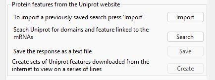
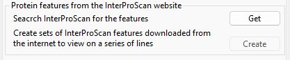
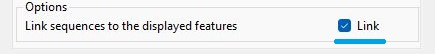
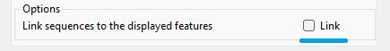
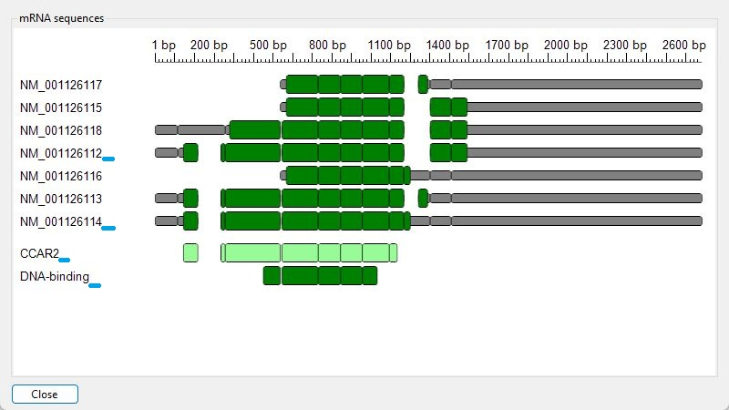

## List of contents
- [Adding metadata to displayed transcripts](FEATURES.md#adding-metadata-to-displayed-transcripts)
  - [Display of metadata present in the imported GenBank files](FEATURES.md#display-of-metadata-present-in-the-imported-genbank-files)
  - [Display of features linked to the transcripts by UniProt](FEATURES.md#display-of-features-linked-to-the-transcripts-by-uniprot)
  - [Display of features identified by InterProScan using a transcript's protein sequence](FEATURES.md#display-of-features-identified-by-interproscan-using-a-transcripts-protein-sequence)
  - [Visually linking GenBank, UniProt and InterProScan features to the transcript used to identify them](FEATURES.md#visually-linking-genbank-uniprot-and-interproscan-features-to-the-transcript-used-to-identify-them)
 
 ---

# Adding metadata to displayed transcripts

The __Features__ tab of the __mRNA Display Options__ window provides controls for the selection and display of sequence domains and motifs in the displayed transcripts (Figure 1).

---

The generation of multiple alternatively spliced transcripts from a single gene enables the production of diverse mRNA molecules, each of which may encode distinct protein isoforms. Because these isoforms differ in sequence, they can vary in function, activity, and stability, allowing the gene to contribute to a broader range of cellular processes and adapt to different physiological conditions. 

To facilitate the visualisation of how motifs and domains are distributed across a gene’s transcripts, you can display annotated features present in the imported GenBank files or through resources such as UniProt and InterProScan. These tools provide detailed mappings of sequence elements, making it easier to compare structural and functional differences among isoforms.

## Display of metadata present in the imported GenBank files

Pressing the __Create__ button in the __Sequence features from the GenBank files__ panel allows the selection and display of features from the imported GenBank files (Figure 2) as described in the link below: 

- [Selecting and displaying features in the GenBank metadata](GenBank.md)

---

Figure 2a

Figure 2b

Figure 2: Features in the GenBank file metadata can be selected and displayed (Figure 2b) by pressing the __Create__ button (blue line in Figure 2a). 

---

## Display of features linked to the transcripts by UniProt

The __Protein features from the UniProt website__ panel (Figure 3a) allow you to obtain and display features linked to the transcripts by the UniProt website (Figure 3b). The process is described in the link below:

- [Obtaining and displaying features suggested by the UniProt website](UniProt.md)

---

Figure 3a

Figure 3b

Figure 3: Features linked to the transcripts by UniProt can be identified and displayed using the controls in the __Protein features from the UniProt website__ panel. 

---

## Display of features identified by InterProScan using a transcript's protein sequence

The __Protein features from the InterProScan website__ panel (Figure 4a) allow you to obtain and display features linked to amino acid sequences of a transcript's open reading frame by the InterProScan website (Figure 4b). The process is described in the link below:

- [Obtaining and displaying features suggested by the InterProScan website](InterProScan.md)

Figure 4a

Figure 4b

Figure 4: Features linked to the transcript's open reading frame by InterProScan can be obtained and displayed using the controls in the __Protein features from the InterProScan website__ panel. 

---

## Visually linking GenBank, UniProt and InterProScan features to the transcript used to identify them

While a GenBank, UniProt and InterProScan feature may be present in one or more transcripts, they are selected based on their presence in a specific transcript. To indicate this link, by default, __TransGBViewer__  adds a superscript number after the transcript's display name and the linked feature's label (Figure 5b). This text can be removed using the tick box in the __Options__ folder (blue lines in Figures 5a to 5d).

Figure 5a

Figure 5b

Figure 5c

Figure 5d

Figure 5: If the __Link__ option is checked (blue line in Figure 5a), each transcript linked to a feature is identified by a number written in superscript displayed at the end of the transcripts. This number is also written in superscript at the end of the feature's label (blue lines in Figure 5b). If the __Link__ option is not checked, the link between transcripts and features is not shown (Figures 5c and 5d).