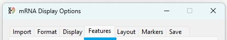
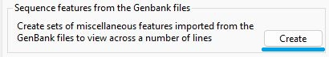
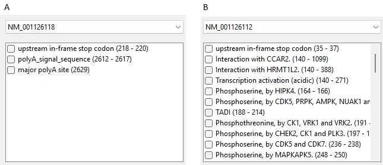

# Adding meta-data to the displayed

The __features__ tab of the ___mRNA Display Options___ window provides controls for selection and display of sequence domains and motifs in the displayed sequences (Figure 1).

The generation of multiple alternatively spliced transcripts from a single gene enables the production of diverse mRNA molecules, each of which may encode distinct protein isoforms. Because these isoforms differ in sequence, they can vary in function, activity, and stability, allowing the gene to contribute to a broader range of cellular processes and adapt to different physiological conditions. 

To facilitate the visualization of how motifs and domains are distributed across a gene’s transcripts, one can examine annotated features available in GenBank records or through resources such as UniProt and InterProScan. These tools provide detailed mappings of sequence elements, making it easier to compare structural and functional differences among isoforms.

## Display of meta-data present in the imported genBank files

The __Sequence features from the Genbank files__ panel at the top of the __features__ tab contains allows the selection and display of features present in the imported Genbank files (Figure 2). 

The __Sequence features from the Genbank files__ panel allows the selection and display of domains and features present in the imported Genbank files (Figure 2).

pressing the __Create__ button (blue line in Figure 2)displays the __Miscellaneous GenBank feature selection__ window (Figure 3). As the features in a GenBank file are linked to a specific sequence entry, a GenBank sequence accession ID has to be selected from the dropdown list in the top right corner of the window (blue line in Figure 3).

Figure 3: The  __Miscellaneous GenBank feature selection__ window allows the selection of features present in the imported Genbank files (Figure 2). Selecting an accession ID from the dropdown list (blue line) causes the features linked to this sequence to be displayed.

The level of annotation can vary widely between different entires with linked features listed in the list box below the accession selection dropdown list (Figure 4a and 4b).

Figure 4: The  number of features linked to an genBank entry varies widely.

## Selecting features to display in the image

Genbank files contain meta-data on a range of features that vary from single bases, three bases at represent a codon or larger domains that span the entry encoded protein. Consequently, it is possible to select one or more features to draw on a single. In Figure 4b in can be seen that the NM_001126112 accession sequence is linked to a number of phosphoserines as well as the larger CCAR2 binding domain. 

### Selecting multiple feature to be displayed on one line

To display the phosphoserines on a single row, first check each box at the side of the phosphoserines entries. Since there are a number, rather than individually each one, enter "phosphoserine" in the text area to the left of the list (blue line Figure 5) and press the __Check__ button (black line in Figure 5). This will check all entries that contain the entered text. Pressing the __Uncheck__ button will unselect any items.

<b>Note:</b> The search function will only work when 3 or more letters have been entered. 

Figure 5: If 3 or more letters are entered in the text area to the lift of the feature list, the number of items containing the text is shown below (green line). Pressing the __Check__ button (black line) selects all matches in the list. Pressing the __Uncheck__ button (red line) deselects all items. 

### Selecting a single feature to be displayed on one line

The method above can also be used to select a single item. However a single item can also be selected by scroll through the items in the list of features until a feature of interest is found and then check the item's tick box.

Figure 6: A single feature can be selected by scrolling through list of features and manually checking it's tick box (Figure 6) 

### Setting the colour of items drawn on a single line

Pressing the __Colour__ button (blue line Figure 7) while display either the  __Select colour by name dialog__ and __Windows colour picker dialog__ box depending on which option is selected (red line in Figure 7). These dialog boxes all you to select a colour as described here: 

- [Using the Select colour by name dialog box](equenceColour.md)
- [Using the Windows colour picker dialog box](ColourPickerDialog.md)

Once selected, the area next to the __Colour__ button will be drawn in the selected colour (black line in Figure 7).

Figure 7: Pressing the __Colour button allows you to select the colour a feature is drawn in (Figure 7) 

