## List of contents
- [The Format tab: adjusting the image's format](FORMAT.md#the-format-tab-adjusting-the-images-format)
  - [Format of the coordinate labels](FORMAT.md#format-of-the-coordinate-labels)
  - ["Display sequence coordinates" options](FORMAT.md#display-sequence-coordinates-options)
  - ["Select the major tick interval" option](FORMAT.md#select-the-major-tick-interval-option)
  - ["Select the minor tick interval" option](FORMAT.md#select-the-minor-tick-interval-option)
  - ["Set the angle of rotation of the coordinate text" option](FORMAT.md#set-the-angle-of-rotation-of-the-coordinate-text-option)
  - [Sequence label formatting](FORMAT.md#sequence-label-formatting)
  - ["Select the location of the labels" option](FORMAT.md#select-the-location-of-the-labels-option)
  - ["Adjust label width area" option](FORMAT.md#adjust-label-width-area-option)
  - ["Select font used to write sequence names" and "Select font used to write feature names" options](FORMAT.md#select-font-used-to-write-sequence-names-and-select-font-used-to-write-feature-names-options)
  - ["Adjust size of gap signifying an intron" option](FORMAT.md#adjust-size-of-gap-signifying-an-intron-option)

---

# The Format tab: adjusting the image's format

The __Format__ tab page of the __mRNA Display Options__ window (blue line in Figure 1) allows you to modify the format of the image by changing the format of the sequence coordinates label (X-axis label), the location and width of the sequence labels, and the size of the gaps representing the location of introns. It is also possible to change the font and font style, but not font size, of the font  used to write the labels.

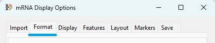

Figure 1: The formatting options are revealed by pressing the __Format__ tab in the __mRNA Display Options__ window.

---

## Format of the coordinate labels

The base pair position of the sequences in the consensus sequence are displayed as a series of major and minor ticks, with those representing the major ticks drawn taller than the minor ticks. Where possible the values of the major ticks are displayed. 
The style of sequence coordinates can be modified using the first four options on the Format tab as described below:

## "Display sequence coordinates" options

The first dropdown list determines whether the coordinates are displayed (option: none – Figure 2a) and whether the values are written above (option: Above – Figure 2b) or below (option: Below – Figure 6c) the interval line.

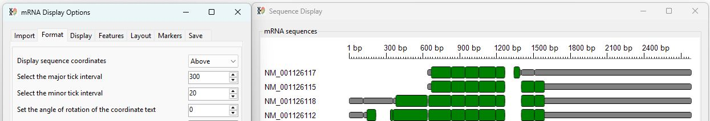

Figure 2a: Selecting *None* from the __Display sequence coordinates__ options hides the coordinates label.

---

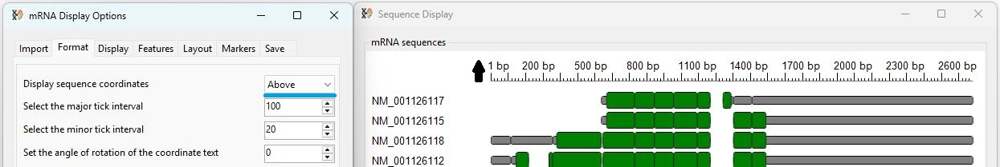

Figure 2b: Selecting *Above* from the __Display sequence coordinates__ options writes the values above the interval line.

---

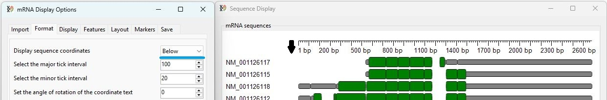

Figure 2c: Selecting *Below* from the __Display sequence coordinates__ options writes the values below the interval line.

---

## "Select the major tick interval" option

The interval between major ticks is set via the __Select the major tick interval__ which accepts any value between 100 and 1,000 in steps of 100.

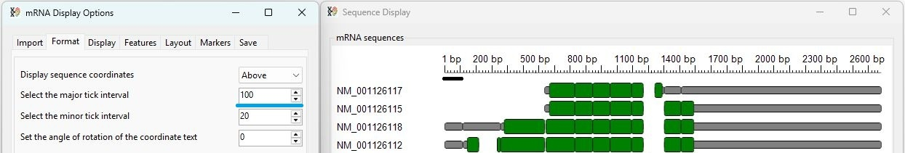

Figure 3a: The __Select the major tick interval__ option's default value of 100 draws the major ticks at 100 bp intervals and annotates the tick only if the text doesn't overwrite a previous value.

---

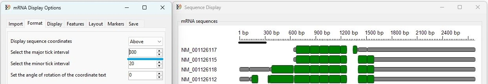

Figure 3b: Setting __Select the major tick interval__ value to 300 draws the major ticks at 300 bp intervals.  Since the interval is wider, all the major ticks are annotated, except the final value (2,700 bp), whose value would be truncated by the edge of the image.

---

## "Select the minor tick interval" option

The __Select the minor tick interval__ value determines the interval between each minor tick, which can be any value between 10 and 100 bp in steps of 10.

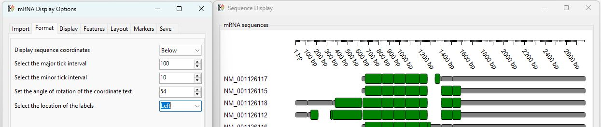

Figure 4a: The __Select the minor tick interval__ option's default value of 20 draws the minor ticks at 20 bp intervals. These ticks are not annotated.

---

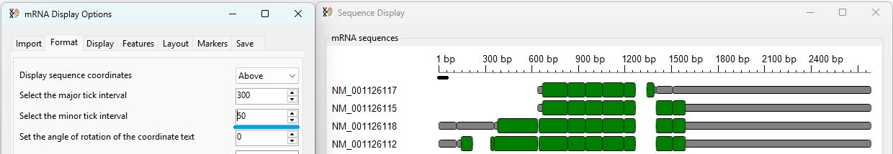

Figure 4b: Setting __Select the minor tick interval__ value to 50 draws the minor ticks at 350 bp intervals. These are not annotated.

## "Set the angle of rotation of the coordinate text" option

A major interval is only annotated if the text does not overwrite previously displayed values. To allow more intervals to be displayed, it is possible to rotate the text between 0' (horizontal) and 90' (vertical) in steps of 1 degree using the __Set the angle of rotation of the coordinate text__ option. 

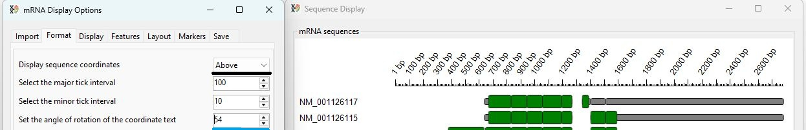

Figure 5a: The __Set the angle of rotation of the coordinate text__ option allows the coordinate values to be rotated anti-clockwise when the __Display sequence coordinates__  option is set to _Above_

---

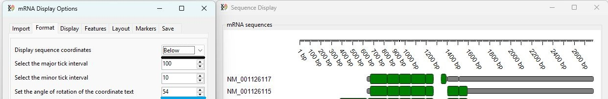

Figure 5b: The __Set the angle of rotation of the coordinate text__ option allows the coordinate values to be rotated clockwise when the __Display sequence coordinates__  option is set to _Below_

---

## Sequence label formatting

The __Format__ tab also contains four controls that dictate how the labels describing the sequences are displayed. These options determine the location of the labels, the width of the area they are displayed in and the font used to draw them.

## "Select the location of the labels" option

The __Select the location of the labels__ dropdown list determines if the sequences are annotated, and if so, whether the text is written to the left or above the sequences.

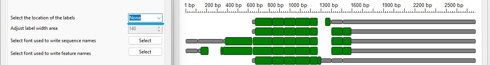

Figure 6a: If _None_ is selected from the  __Select the location of the labels__  dropdown list, no labels are written.

---

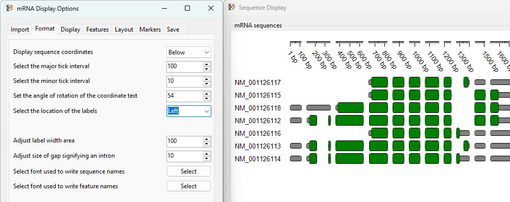

Figure 6b: If _Left_ is selected from the  __Select the location of the labels__  dropdown list, the labels are written to the left of the sequences.

---

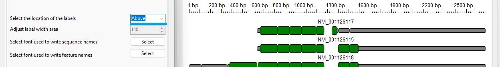

Figure 6c: If _Above_ is selected from the  __Select the location of the labels__  dropdown list, the labels are written Above of the sequences.

---

## "Adjust label width area" option

The __Adjust label width area__ option sets the width of the area used to write the labels on the left of the image. <b>Note: This option only has an effect if the __Select the location of the labels__ option is set to _Left_.</b> The size range is from 50 to 200, which is equivalent to its width in pixels when drawn at 96 DPI – the typical monitor screen resolution.

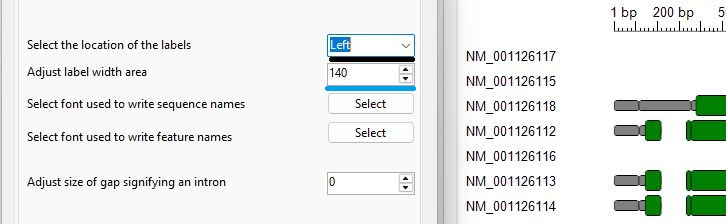

Figure 7a: Initially, the label width area is set to 140 pixels (at 96 DPI).

---

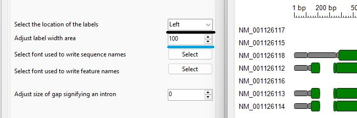

Figure 7b: Changing the value in the __Adjust label width area__ control adjusts the width of the labels.

---

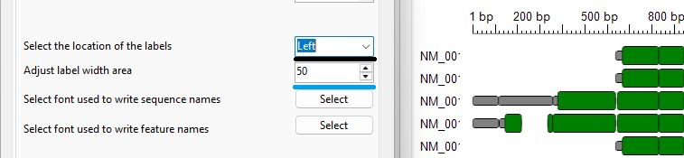

Figure 7c: If the text is wider than the width of the label area, it is truncated. The sequences are always drawn with a 15-pixel (at 96 DPI) margin on their left and right sides.

---

## "Select font used to write sequence names" and "Select font used to write feature names" options

Text is written in a generic sans serif font of size 10 with no styling, which typically defaults to the Arial font, but this is computer dependent. These fonts can be changed via the __Select font used to write sequence names__ and __Select font used to write feature names__ options. The __Select font used to write sequence names__ option governs the font used to write the names of the sequences, while the __Select font used to write feature names__  determines the font used to write the names of any features displayed (these are selected using the options on the __Features__ tab).

Pressing either of the __Select__ buttons displays the font selection dialog box (Figures 8a and 8b). This allows any font on the computer and its style (regular, bold and/or italic) to be selected. However, changes to the font size will be ignored.

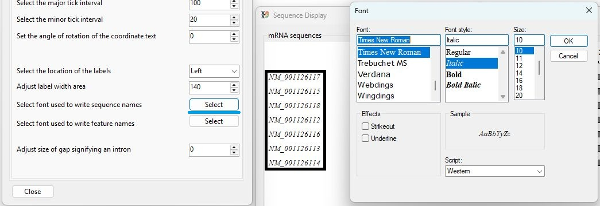

Figure 8a: Pressing the __Select__ button to the right of the __Select font used to write sequence names__ text allows the font used to write the sequence names to be changed. In Figure 8a, the font is changed to the italic version of the serif font – Times New Roman. 

---

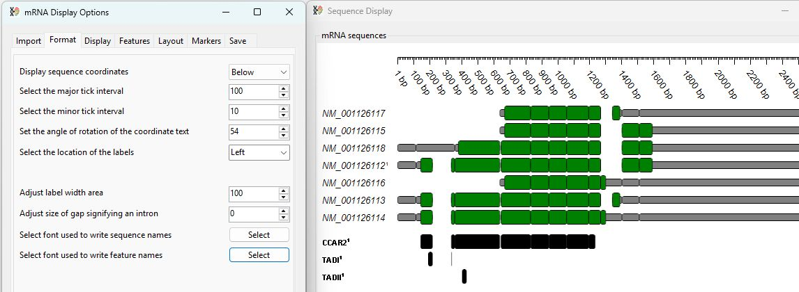

Figure 8b: Pressing the __Select__ button to the right of the __Select font used to write feature names__ text allows the font used to write the names of any feature (see the __Feature__ tab description) to be changed. In Figure 8b the font is changed to the regular version of the sans serif font – Impact. 

---

## "Adjust size of gap signifying an intron" option

By default two consecutive exons are drawn with no gap between them (Figure 10a). However, to draw attention to the location of introns, it is possible to insert a gap at these locations using the __Adjust size of gap signifying an intron__ option (Figure 13b). This gap can be from 0 to 20 pixels (at 96 DPI) in length. If gaps are inserted in the transcripts, gaps are also inserted into the sequence coordinate label. 

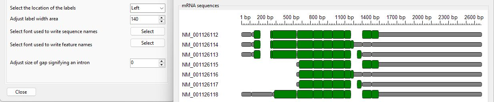

Figure 10a: Pairs of exons that do not flank alternatively spliced exons are drawn as an uninterrupted series of rectangles. 

---

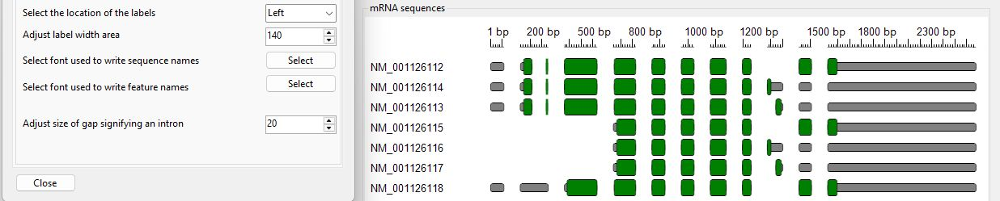

Figure 10b: Adjusting the __Adjust size of gap signifying an intron__ option allows the location of introns to be easily seen by inserting a gap at splice sites.  

---

