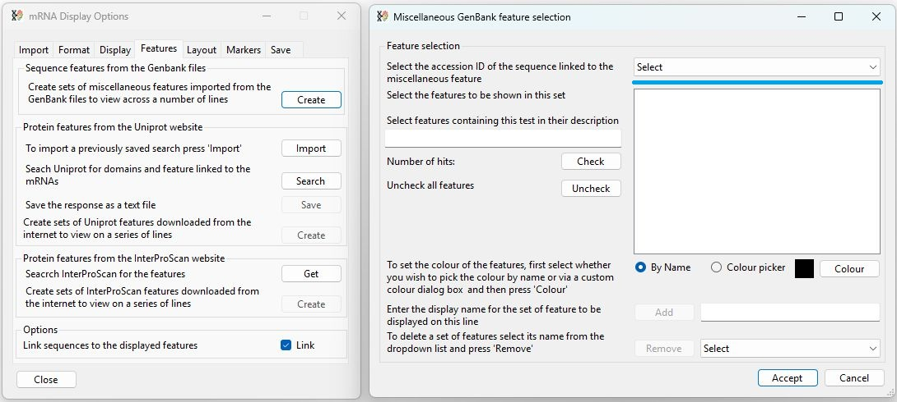
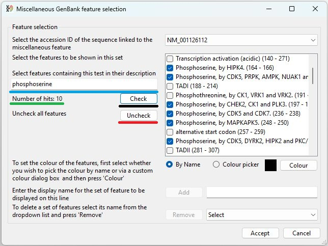
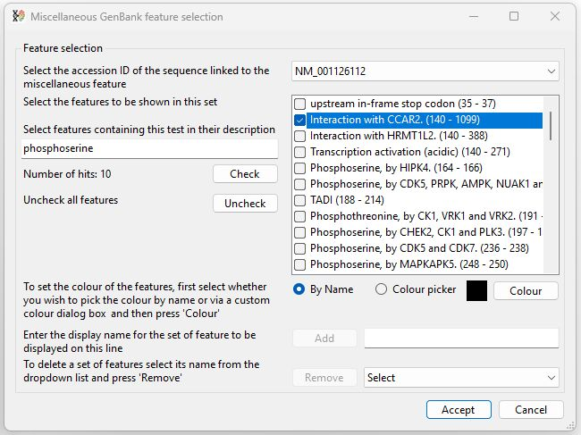
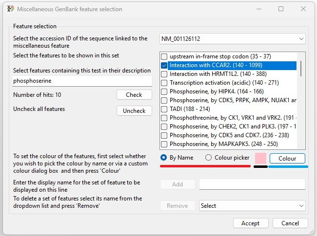
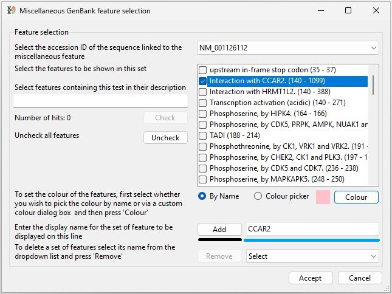
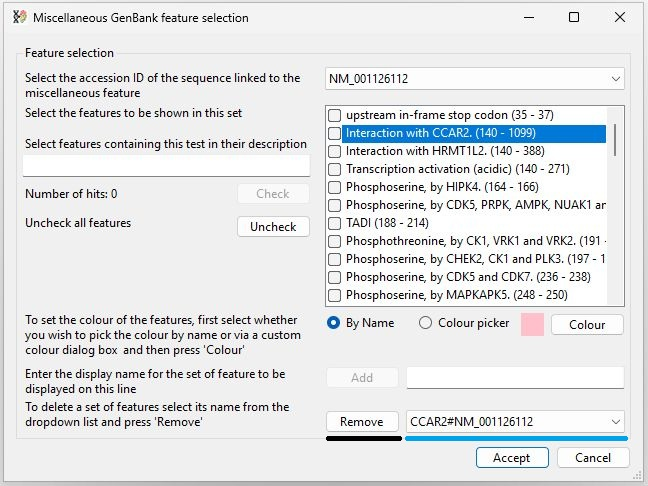
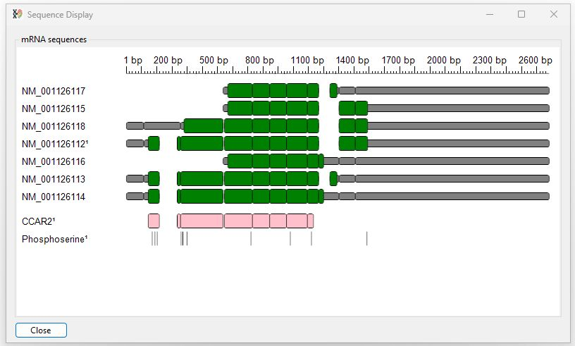

# Displaying metadata present in the imported GenBank files

The __Sequence features from the GenBank files__ panel at the top of the __features__ tab allow the selection and display of features present in the imported GenBank files (Figure 21). 

The __Sequence features from the GenBank files__ panel allow the selection and display of domains and features present in the imported GenBank files (Figure 1).

---

Pressing the __Create__ button (blue line in Figure 1) displays the __Miscellaneous GenBank feature selection__ window (Figure 2). As the features in a GenBank file are linked to a specific transcript entry, a GenBank sequence accession ID has to be selected from the dropdown list in the top right corner of the window (blue line in Figure 2).

Figure 2: The  __Miscellaneous GenBank feature selection__ window allows the selection of features present in the imported GenBank files (Figure 1). Selecting an accession ID from the dropdown list (blue line) causes the features linked to that transcript to be displayed.

---

The level of annotation can vary widely between different entries, with linked features listed in the list box below the accession selection dropdown list (Figures 3a and 3b).

Figure 3: The  number of features linked to a GenBank entry varies widely.

---

## Selecting features to display in the image

GenBank files contain metadata on a range of features that may be a single base, a codon's three bases or larger domains that span the entire encoded protein. Consequently, it is possible to select one or more features to draw on a single line. In Figure 3b it can be seen that the NM_001126112 accession sequence is linked to a number of phosphoserines as well as the larger CCAR2 binding domain. 

### Selecting multiples feature to be displayed on one line

To display the phosphoserines on a single row, first check each box at the side of the phosphoserine entries. Since there are a number, instead of selecting each one individually, enter "phosphoserine" in the text area to the left of the list (blue line in Figure 4) and press the __Check__ button (black line in Figure 4). This will check all entries that contain the entered text. Pressing the __Uncheck__ button will unselect any items.

<b>Note:</b> The search function will only work when 3 or more letters have been entered. 

Figure 4: If 3 or more letters are entered in the text area to the left of the feature list, the number of items containing the text is shown below the text area (green line). Pressing the __Check__ button (black line) selects all matches in the list. Pressing the __Uncheck__ button (red line) deselects all items. 

---

### Selecting a single feature to be displayed on one line

The method above can also be used to select a single item. However, a single item can also be selected by scrolling through the items in the list of features until a feature of interest is found and then checking the item's tick box.

Figure 5: A single feature can be selected by scrolling through the list of features and manually checking its tick box (Figure 5). 

---

### Setting the colour of items drawn on a single line

Pressing the __Colour__ button (blue line in Figure 6) will display either the  __Select colour by name dialog__ box or the __Windows colour picker dialog__ box depending on which option is selected (red line in Figure 6). These dialog boxes allow you to select a colour as described here: 

- [Using the Select colour by name dialog box](SequenceColour.md)
- [Using the Windows colour picker dialog box](ColourPickerDialog.md)

Once selected, the area next to the __Colour__ button will be drawn in the selected colour (black line in Figure 6).

Figure 6: Pressing the __Colour__ button allows you to select the feature's colour. 

---

## Saving the features to be drawn

Once a line's features and its colour have been selected, it is saved by entering the line's display name in the text area (blue line in Figure 7) to the right of the __Add__ button (black line in Figure 7). This name will also be used as the line's label in the final image and so must be informative, correctly capitalised and 3 or more letters in length. Entering a label name will make the  __Add__ button active, while pressing it will add the line to the set of feature lines to be displayed and clear the text area. If a feature line with the same name has already been saved, the __Add__ button will be named __Update__, and pressing it will update the previously saved feature row.

Figure 7: A feature row is saved by entering its display name in the text area (blue line) and pressing __Add__ (black line). 

---

## Removing a line

Once added, a feature line's name is added to the dropdown list (blue line in Figure 8) to the right of the remove button (black line in Figure 8). A line's name is composed of its display name and the name of the sequence it is linked to: \<name\>#\<linked sequence name\>. Selecting a name from the dropdown list and pressing __Remove__ will delete the line.

Figure 8: A feature row is removed by selecting its name ("display name" + # + "linked sequence name") in the text area (blue line) and pressing __Remove__ (black line). 

---

## Accepting the feature edits and redrawing the image

The changes to the collection of the feature lines are only saved if the __Accept__ button at the bottom of the __Miscellaneous GenBank feature selection__ window is pressed. 

Figure 9: The feature rows are added to the image if the __Accept__ button at the bottom of the __Miscellaneous GenBank feature selection__ window is pressed. 

---