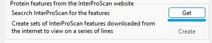
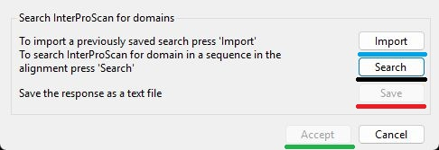
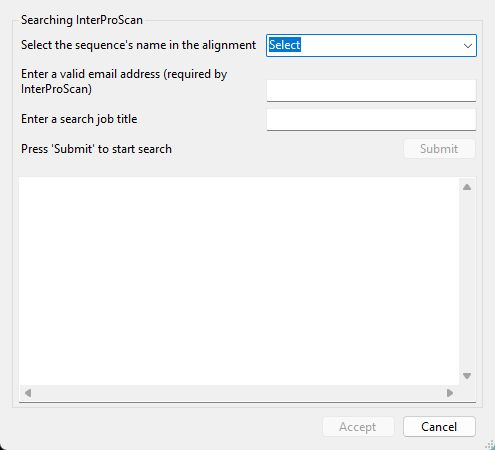
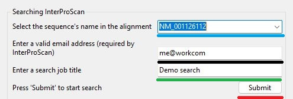
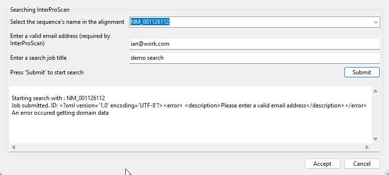
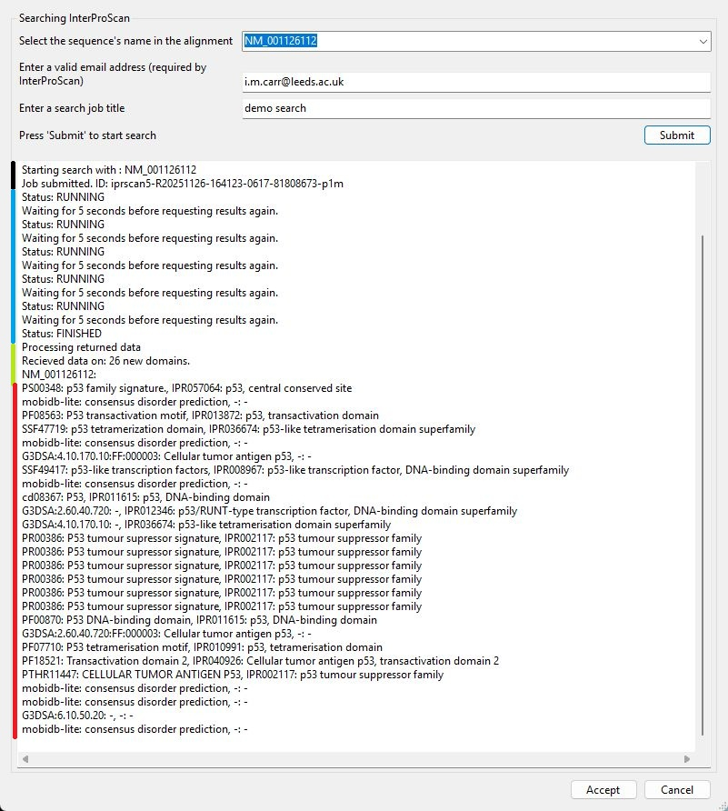
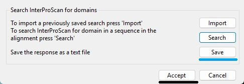
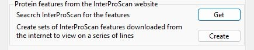

# Display of features linked to the transcripts by InterProScan

The __Protein features from the InterProScan website__ panel (Figure 1) contains the controls required to obtain, select, format and display features linked to to the transcripts by the UniProt website. Pressing the __Get__ button (blue line in Figure 1) displays the __Import InterProScan features__ window (Figure 2)

Figure 1: Pressing the _get__ button on the __Protein features from the InterProScan website__ panel (Figure 1) displays the __Import InterProScan features__ window (Figure 2).

---

The __Import InterProScan features__ window contains 4 button need to;

- __Import__ button: import InterProScan data form a previously save search (blue lin in Figure 2).
- __Search__ button: query the InterProScan site for features linked to the transcripts (black line in Figure 2).
- __Save__ button: save the results of a InterProScan search for later use (red line in Figure 2).
- __Accept__ button: accept any features obtained from InterProScan.

Figure 2: The __Import InterProScan features__ window  contains the controls require to retrieve and save features linked to the transcript's protein sequences.

---

## Retrieving a previously saved search result

Pressing the __Import__ button (blue line in Figure 12) allows you to select a file that contains a previously stored search result, which was saved using the __Save__ button (red line in Figure 2). If the data is successfully imported the __Accept__ button (green line in Figure 2) will become active allowing you to select and display features linked to the transcripts.

## Saving a successful search

If a InterProScan search is successful, the __Save__ button (red line in Figure 2) will become active. Pressing the __Save__ button will allow you to save the search data to file.

## Obtaining features linked to protein sequences in the transcripts

Pressing the __Search__ button the Import InterProScan features__ window displays the __Sequence domain search__ window (Figure 3).

Figure 3: The __Sequence domain search__ window allows you obtain InterProscan data for a specific transcript.

---

## Preparing for a search

To search the InterProScan site, you most first select a transcript ID from the drop-down list box (blue line in Figure 4). You most also enter an email address in the text area below the drop-down list (black line in Figure 4). This email address is required by InterProScan and appear to be a genuine address as judged by InterProScan. Finally, you need to enter a job title in the lower text area (green line in Figure 4), which may be any text of 3 or more letters. When the required information has been added, the __Submit__ button becomes active. 

Figure 3: To submit a search to InterpPoScan, you need to select a transcript, supply an email address and give the search a title.

---

## Performing a search

Pressing the __Submit__ button starts the search, with feedback shown in the lower text area. If InterProScan doesn't accept the entered email address an error similar to that shown in Figure 5 will be displayed.

Figure 5: If InterProScan rejects the email address this message will be returned

---

### Feedback from a successful search
As the search is performed feedback is displayed in the large text area. The feedback identifies were the search is as described below:

- Initially, the ID of the transcript used in the search is displayed followed by the searches job ID, in Figure 6 this is: iprscan5-R20251126-164123-0617-81808673-p1m (black line in Figure 6).
- Once submitted, InterProScan is prompted to return the status of the search. In Figure 6, the status is "RUNNING" 5 status requests, before finally returning "FINISHED". If the server is busy the searches initial status may be "QUEUED" (blue line in Figure 6).
-  Once the search is complete, InterProScan will be prompted to return the results, which will then be processed (green line in Figure 6).
- Once the returned data has been processed, a list of the domains is shown (red line in Figure 6).

Figure 6: During a search, feedback is displayed in the large lower text area.

---

## Accepting the results

If the search is successful, the __Accept__ button will become active. Pressing the __Accept__ button will close the window and the __Save__ and __Accept__ buttons on the __Import InterProScan features__ form will be enabled (blue and black lines in  Figure 7). 

Figure 7: The  __Save__ and __Accept__ buttons on the __Import InterProScan features__ form will be enabled (blue and black lines)

---

Pressing the __Accept__ button on __Import InterProScan features__ form closes the window and the __Create__ button in the __Protein features from the InterProScan website__ panel will become active (Figure 8)

Figure 8: The  __Create__ button in the __Protein features from the InterProScan website__ panel will become active if the search is accepted.

---
