## List of contents
- [Displaying features linked to the transcripts by InterProScan](InterProScan.md#displaying-features-linked-to-the-transcripts-by-interproscan)
  - [Retrieving a previously saved search result](InterProScan.md#retrieving-a-previously-saved-search-result)
  - [Saving a successful search](InterProScan.md#saving-a-successful-search)
  - [Obtaining features linked to protein sequences in the transcripts](InterProScan.md#obtaining-features-linked-to-protein-sequences-in-the-transcripts)
  - [Preparing for a search](InterProScan.md#preparing-for-a-search)
  - [Performing a search](InterProScan.md#performing-a-search)
    - [Feedback from a successful search](InterProScan.md#feedback-from-a-successful-search)
  - [Accepting the results](InterProScan.md#accepting-the-results)
  - [Selecting features for display](InterProScan.md#selecting-features-for-display)
  - [Setting the domain's display name using values linked to the domain](InterProScan.md#setting-the-domains-display-name-using-values-linked-to-the-domain)
  - [Manually entering the domain's display name](InterProScan.md#manually-entering-the-domains-display-name)
  - [Modifying the appearance of the domain in the final image](InterProScan.md#modifying-the-appearance-of-the-domain-in-the-final-image)
  - [Saving the domain's formatting and selecting it to be displayed in the final image](InterProScan.md#saving-the-domains-formatting-and-selecting-it-to-be-displayed-in-the-final-image)
  - [Deselecting a domain selected to be drawn](InterProScan.md#deselecting-a-domain-selected-to-be-drawn)
  - [Redrawing the transcripts with the InterProScan domains](InterProScan.md#redrawing-the-transcripts-with-the-interproscan-domains)

---

# Displaying features linked to the transcripts by InterProScan

The __Protein features from the InterProScan website__ panel (Figure 1) contains the controls required to obtain, select, format and display features linked to the transcripts by the InterProScan website. Pressing the __Get__ button (blue line in Figure 1) displays the __Import InterProScan features__ window (Figure 2).

Figure 1: Pressing the __Get__ button on the __Protein features from the InterProScan website__ panel (Figure 1) displays the __Import InterProScan features__ window (Figure 2).

---

The __Import InterProScan features__ window contains 5 buttons whose functions are:

- __Import__ button: import InterProScan data from a previously saved search (blue line in Figure 2).
- __Search__ button: query the InterProScan site for features linked to the transcripts (black line in Figure 2).
- __Save__ button: save the results of an InterProScan search for later use (red line in Figure 2).
- __Accept__ button: accept any features obtained from InterProScan.
- __Cancel__ button: disregard any imported features.

Figure 2: The __Import InterProScan features__ window  contains the controls required to retrieve and save features linked to the transcript's protein sequences.

---

## Retrieving a previously saved search result

Pressing the __Import__ button (blue line in Figure 12) allows you to select a file that contains a previously stored search result, which was saved using the __Save__ button (red line in Figure 2). If the data is successfully imported, the __Accept__ button (green line in Figure 2) will become active, allowing you to select and display features linked to the transcripts.

## Saving a successful search

If an InterProScan search is successful, the __Save__ button (red line in Figure 2) will become active. Pressing the __Save__ button will allow you to save the search data to a file.

## Obtaining features linked to protein sequences in the transcripts

Pressing the __Search__ button in the __Import InterProScan features__ window displays the __Sequence domain search__ window (Figure 3).

Figure 3: The __Sequence domain search__ window allows you to obtain InterProScan data for a specific transcript.

---

## Preparing for a search

To search the InterProScan site, you must first select a transcript ID from the drop-down list box (blue line in Figure 4). You must also enter an email address in the text area below the drop-down list (black line in Figure 4). This email address is required by InterProScan and must be a genuine address as judged by InterProScan. <b>This email address is not used or stored by ___TransGBViewer___</b>. Finally, you need to enter a job title in the lower text area (green line in Figure 4), which may be any text of 3 or more letters. When the required information has been added, the __Submit__ button becomes active. 

Figure 4: To submit a search to InterProScan, you need to select a transcript, supply an email address and give the search a title.

---

## Performing a search

Pressing the __Submit__ button starts the search, with feedback shown in the lower text area. If InterProScan doesn't accept the entered email address, an error message similar to that shown in Figure 5 will be displayed.

Figure 5: If InterProScan rejects the email address, this message will be returned.

---

### Feedback from a successful search
As the search is performed, feedback is displayed in the large text area. The feedback shows the current stage of the search as described below:

- Initially, the ID of the transcript used in the search is displayed, followed by the search's job ID. In Figure 6 this is iprscan5-R20251126-164123-0617-81808673-p1m (black line in Figure 6).
- Once submitted, InterProScan is prompted to return the status of the search. In Figure 6, the status "RUNNING" is returned for 5 status requests before finally returning "FINISHED". If the server is busy, the search's initial status may be "QUEUED" (blue line in Figure 6).
-  Once the search is complete, InterProScan will be prompted to return the results, which will then be processed (green line in Figure 6).
- Once the returned data has been processed, a list of the domains is shown (red line in Figure 6).

Figure 6: During a search, feedback is displayed in the large lower text area.

---

## Accepting the results

If the search is successful, the __Accept__ button will become active. Pressing the __Accept__ button will close the form, and the __Save__ and __Accept__ buttons on the __Import InterProScan features__ form will be enabled (blue and black lines in  Figure 7). 

Figure 7: The  __Save__ and __Accept__ buttons on the __Import InterProScan features__ form will be enabled (blue and black lines).

---

Pressing the __Accept__ button on the __Import InterProScan features__ form closes the window, and the __Create__ button in the __Protein features from the InterProScan website__ panel will become active (Figure 8).

Figure 8: The  __Create__ button in the __Protein features from the InterProScan website__ panel will become active if the search is accepted.

---

## Selecting features for display

<b>Note:</b> Unlike the presentation of the GenBank and UniProt features, due to their length, it is not possible to display multiple InterProScan features on a single line. 

Pressing the  __Create__ button in the __Protein features from the InterProScan website__ panel will open the __Domain selection__ window, which allows you to select a domain for display (Figure 9). 

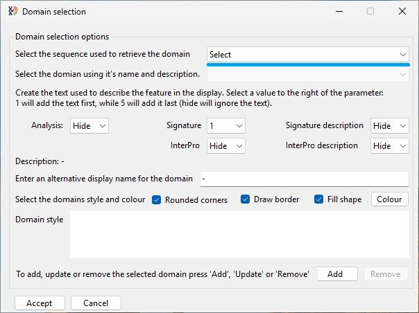

Figure 9: The __Domain selection options__ window allows you to select domains for display.

---

The InterProScan features are linked to a transcript; consequently, you must first select a transcript to which features have been linked using the upper drop-down list (blue line in Figure 9).  

Once a transcript has been selected, the names of the domains linked to it will appear in the second drop-down list (blue box in Figure 10). The length and position of the domains are indicated by appending the position of the domain's first and last residues to its name in the list. For example, the highlighted domain starts at residue 97 and ends at residue 287.

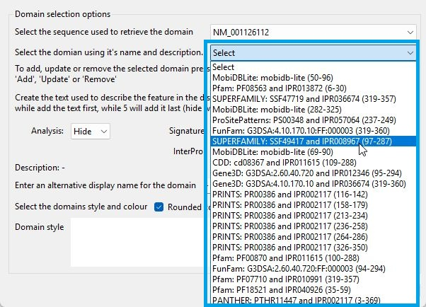

Figure 10: Once a transcript has been selected, the second drop-down list will contain the names of the InterProScan domains linked to it (blue box).

---

Selecting a domain in the drop-down list (blue line in Figure 11) displays a graphical representation of the domain at the bottom of the form (black box in Figure 11).

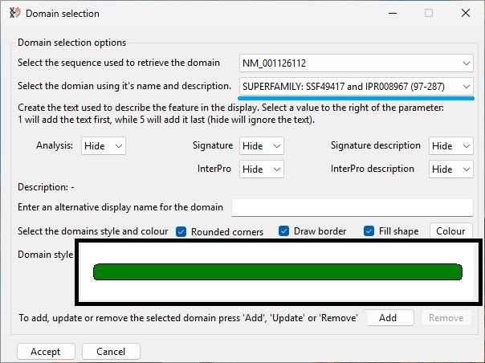

Figure 11: Selecting a domain (blue line) causes a graphical representation of it to be drawn (black box).

---

## Setting the domain's display name using values linked to the domain

Each domain contains 5 different descriptions:
- Analysis: the name of the method used to find the domain
- Signature: the domain's signature ID
- Signature description: short description of the domain
- InterPro: the domain's InterPro ID
- InterPro description: short description of the domain

It is possible to use one or more of these labels as the domain's display name in the final image. The display name is selected using the five drop-down lists highlighted in Figure 12. Alternatively, a label can be entered in the text area below the drop-down lists (black line in Figure 12).

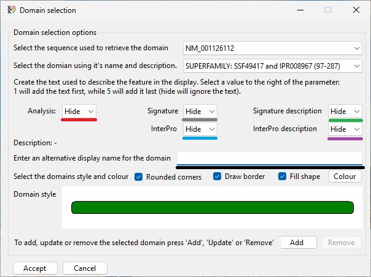

Figure 12: The domain's display name is selected using the highlighted drop-down lists or by entering a label in the text area (black line).

---

Each drop-down list contains the word 'Hide' and the numbers one to five. If the word 'Hide' is selected, the term linked to that descriptor will not be displayed. However, if a number is selected, the domain's display name will contain the linked descriptor. If numbers are selected in more than one drop-down list, the display name will consist of the descriptors written in the order of the numbers. For example, in Figure 13, the drop-down lists are set as:

- Analysis: 5
- Signature: Hide
- Signature description: 1
- InterPro: 2
- InterPro description: Hide

Consequently the display name starts with the 'signature description', then the 'InterPro ID' value and finally the name of the 'analysis'. If two drop-down lists share the same numeric value, the text is selected as follows: Analysis > Signature > Signature description > InterPro > InterPro description. 

The display name based on the values in the drop-down list is displayed in text below the drop-down lists (blue line in Figure 13).

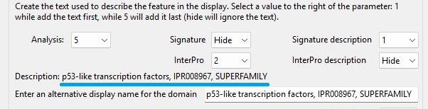

Figure 13: The domain's display name based on the selection in the drop-down list is shown below the drop-down lists (blue line). 

---

## Manually entering the domain's display name

Since the descriptions and IDs linked to the domain can be cryptic (Signature ID or InterPro ID) or too long to be easily displayed (Signature description or InterPro description), it is possible to manually enter a display name by typing it into the text area below the drop-down lists (blue line in Figure 14). This value will be overwritten if the value of any of the drop-down lists is changed and will only become permanent when the domain is saved (see [here](#saving-the-domains-formatting-and-selecting-it-to-be-displayed-in-the-final-image)).

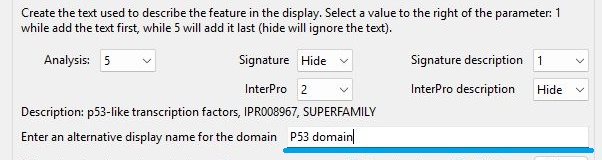

Figure 14: The domain's display name can be set by entering it in the text area below the drop-down lists (blue line). 

---

## Modifying the appearance of the domain in the final image

The appearance of the domain in the final image can be modified using the options above the graphical representation of the domain as shown in Figures 15a to 15d. By default, all the options are selected, producing a green domain with a border and rounded corners (Figure 15a). 

<b>Note:</b> You cannot deselect both the __Draw border__ and __Fill shape__ options at the same time.

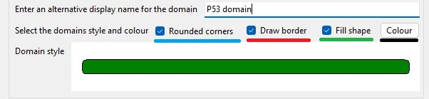

Figure 15a: The domain's appearance in the final image can be modified using the highlighted controls. 

---

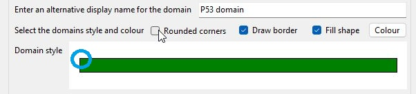

Figure 15b: Deselecting the __Rounded corners__ option draws the domain with square corners (blue circle in Figure 15b).

---

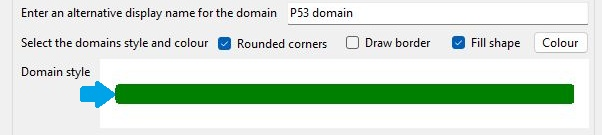

Figure 15c: Deselecting the __Draw border__ option draws the domain without a black border (blue arrow in Figure 15c).

---

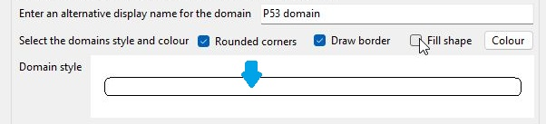

Figure 15d: Deselecting the __Fill shape__ option draws the domain as a black border with no fill colour (blue arrow in Figure 15b).

---

The final option is to change the colour used to fill the domain; this is set by pressing the __Colour__ button (blue line in Figure 16). By default, the domains  are coloured green. To change their colour, press the __Colour__ button (blue line in Figure 16a). This will display a window called  __Select the domain's fill colour__ (Figure 16b). This window allows a colour to be selected by either its Windows system name if the __List of names__ option is selected (black line in Figure 16b) or with the Windows colour picker dialog window if the __Colour dialog box__ option is selected (green line in Figure 16b) and the __Colour__ button is pressed (red line in Figure 16b).

- [Using the Select colour by name dialog](equenceColour.md)
- [Using the Windows colour picker dialog](ColourPickerDialog.md)

The new colour will then be displayed next to the __Colour__ button. Pressing the __Accept__ button will close the window and change the colour used to draw the domain (black box in Figure 16c).

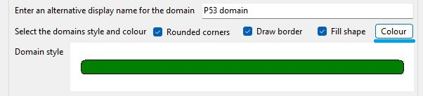

Figure 16a: The colour of a domain can be changed by pressing the __Colour__ button (blue line) and selecting the colour using the displayed dialog box (Figure 16b).

---

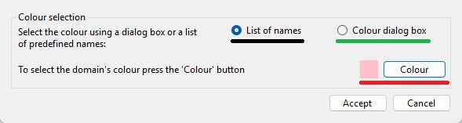

Figure 16b:  Once changed, the colour is shown next to the __Colour__ button (red line).

---

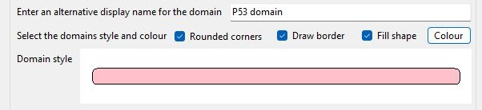

Figure 16c:  When the __Accept__ on the __Select the domain's fill colour__ window is pressed the form closes and the domain's fill colour changes to the selected colour.

---

## Saving the domain's formatting and selecting it to be displayed in the final image

Once the domain's display name and format have been set, it can be selected to be included in the final image. This is done by pressing the __Add__ at the top of the form (blue line in Figure 17a). Once added, whenever that domain is selected in the domains drop-down list, the name on the __Add__ button changes to __Update__ (blue line in Figure 17b), and the __Remove__ button becomes active (black line in Figure 17b). Pressing the __Update__ button replaces all previous formatting and its display name with those currently selected. 

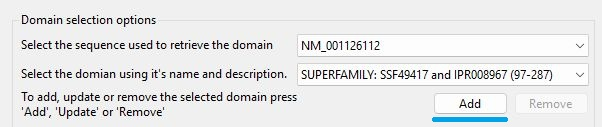

Figure 17a: Pressing the __Add__ button saves the formatting and sets the domain to be drawn in the final image.

---

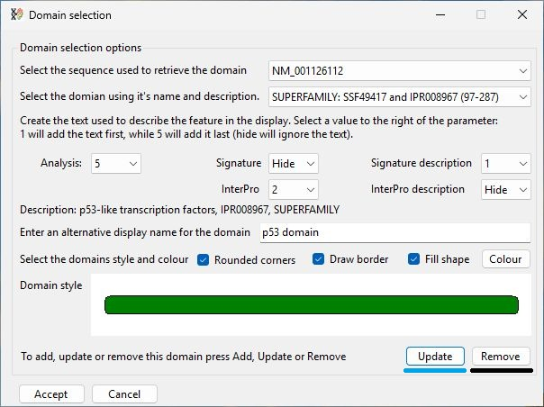

Figure 17b:  Whenever a saved domain is selected, the __Add__ button is renamed __Update__ (blue line) and the __Remove__ button is activated (black line).

---

## Deselecting a domain selected to be drawn

To deselect a domain, select it in the domain name drop-down list and press the __Remove__ button (blue line in Figure 18).

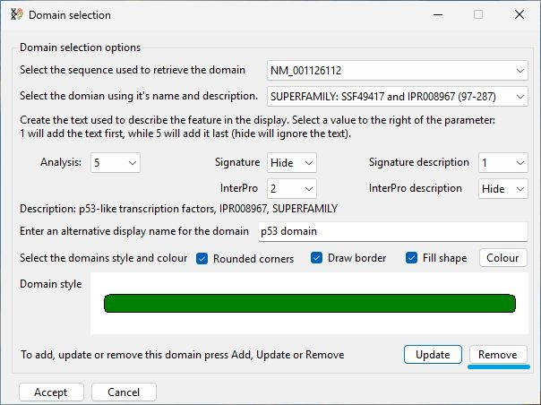

Figure 18: Pressing the __Remove__ button removes the feature line from the display set, and so is not included in the final image.

---

## Redrawing the transcripts with the InterProScan domains

Pressing the __Accept__ button closes the __Domain selection__ window and redraws the image.

Figure 19: Pressing the __Accept__ button closes the __Domain selection__ window and redraws the transcript image with the InterProScan domains.

---