# Adjusting the order of each Feature class

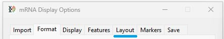

Figure 1: The __Layout__ tab of the ___mRNA Display Options___ window allows you to change both the layout order and the order/names of transcripts (Figure 1).

In the previous tabs, you could create an image displaying aligned transcript sequences along with metadata from GenBank files and data from UniProt and InterProScan. By default, the order is:

- coordinate axis label (blue box in Figure 2)
- the aligned transcripts (black box in Figure 2) 
- GenBank file metadata (green box in Figure 2)
- UniProt features (red box in Figure 2)
- InterProScan features (grey box in Figure 2)

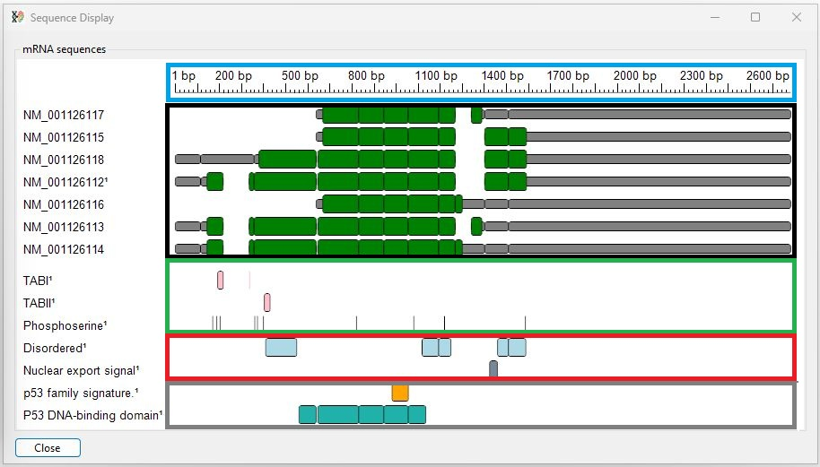

Figure 2: The default layout order of the data blocks

---

## Changing the order of the feature classes of the image

<b>Note:</b> The grid contains all the feature class names irrespective of whether they are present in the image.

The __Feature class order__ panel in the __Layout__ tab contains a grid listing all feature class names (blue box in Figure 3). If a name is selected, you can change its position relative to other features using the two buttons to the left of the grid (red and green boxes in figure 3) 

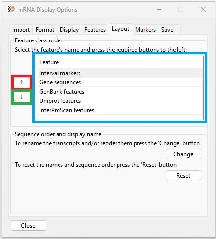

Figure 3: The order of a class of features can be changed by selecting it in the grid (blue box) and then pressing the Up (red box) or Down (green box) buttons. 

---

Selecting the __Interval markers__ feature name and pressing the down arrow button moves it one place down in the grid (black line in Figure 4). This also moves the __Interval marker__ label below the transcripts (blue box in Figure 4).

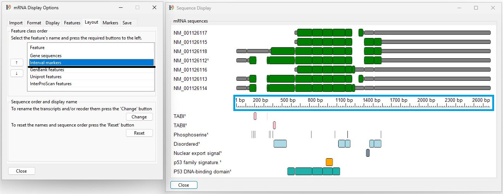

Figure 4: Selecting a features class name in the grid (black line) and pressing one of the arrow buttons moves the selected feature class name relative to the other names in both the grid and the image (blue box).

---
 
## The sequence order and display name panel

The order in which the transcripts are drawn is determined by the order the sequences occur in a multi-entry GenBank file and/or the GenBank file names in a folder of sequence files. While their display name is the GenBank access ID used in the files. The  **Sequence order and display name** panel allows you to reorder and/or rename the transcripts as well as omit sequences from the final image. The panel also allows you to reset the order and display names.

## Modifying the transcripts displayed

The __Sequence order and display name__ panel contains the __Change__ button (blue line Figure 5) that allows you to modify how the transcripts are ordered and named. Pressing the __Change__ button opens the __Rename transcripts__ form (Figure 5)

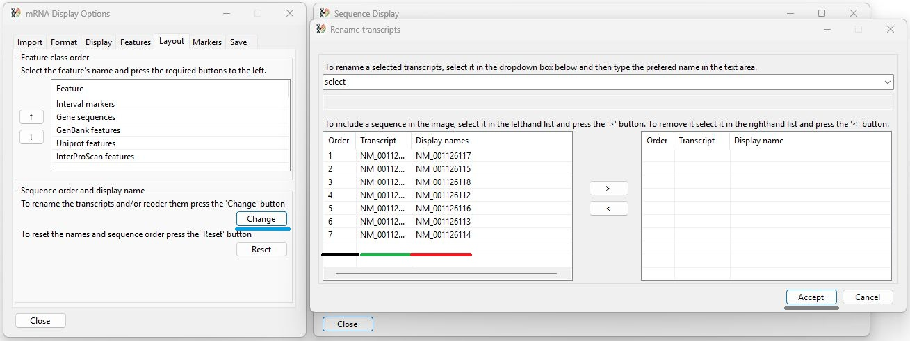

Figure 5: Pressing the __Change__ button (blue line) opens the __Rename transcripts__ form which allows you to change the order of the transcripts, omit transcripts from the final image and also rename them.

---

## The "Rename transcripts" form

### Reordering and omitting transcripts

The __Rename transcripts__ form consists of two lists of sequences names (blue and black boxes in Figure 6).  Initially the left-hand list contains all the sequence names, while the right-hand grid is empty. 
Both lists have the same 3 column format, the __Order__ column (black line Figure 5) indicates the current position of that transcript in the image, the __Transcript__ column (green line Figure 5) shows the transcripts GenBank ID and the __Display name__ column (red line Figure 5) shows the transcript's display name. 

Only transcripts in the right-hand list will be displayed if the form is closed by pressing the window's __Accept__ button (grey line Figure 5). Also the order in which the transcripts are listed in the right-hand list is the order in which they are displayed.

#### Moving sequences from one list to the other

To move a transcript from the left-hand list to the right-hand list, select the transcript in the left-hand list by clicking on it (Figure 6a). Then press the __Right__ arrow button (blue line Figure 6a). 

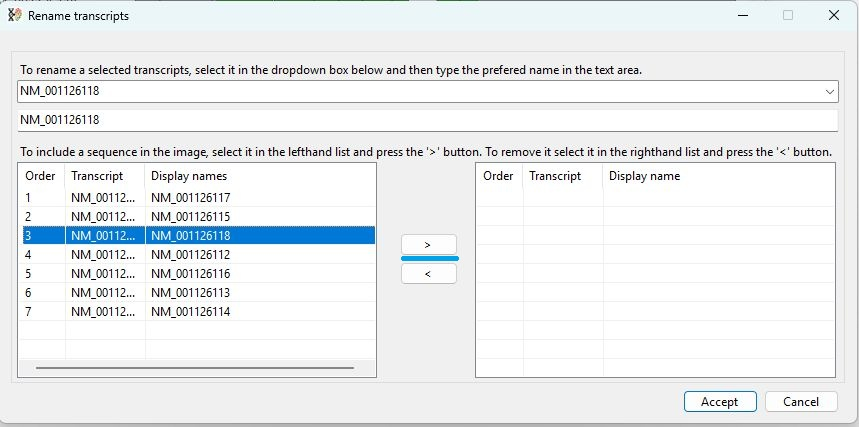

Figure 6a

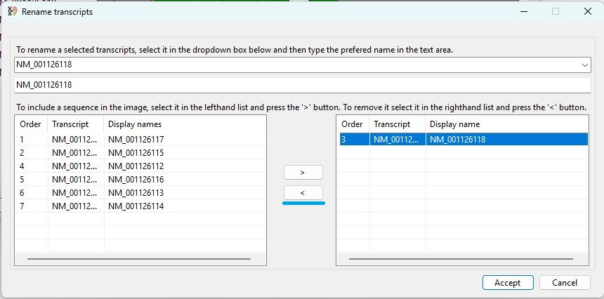

Figure 6b

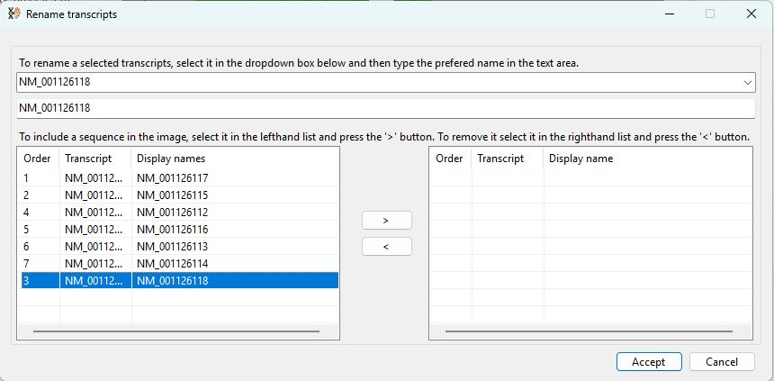

Figure 6c

Figure 6: Selecting a transcript in the left-hand list and pressing the __Right__ arrow button (blue line Figure 6a) will remove the transcript from the left-hand list and place it in the right-hand list (Figure 6b). Selecting a transcript in the right-hand list and pressing the __Left__ arrow button (blue line Figure 6b) will move the transcript back to the left-hand list (Figure 6c).

---

#### Setting the order and omitting transcripts

When a transcript is moved it is added to the bottom of the relevant list (Figure 6c), consequently, move the transcripts to the right-hand list in the order you want them to appear in the final image. To omit a transcript, do not transfer it to the right-hand list. 

For example in Figure 7a the last 4 transcripts have been transferred to the right-hand list in reverse order. When the __Accept__ is pressed the image will be redrawn with the first three transcripts omitted and the last four shown in the reverse order (Figure 7b)

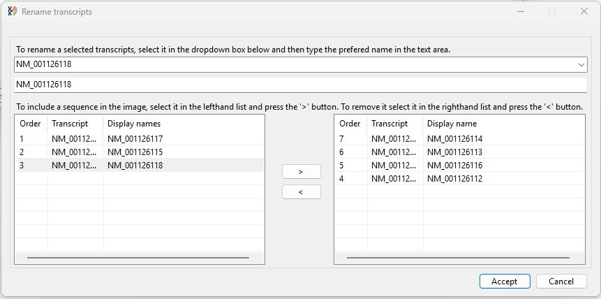

Figure 7a

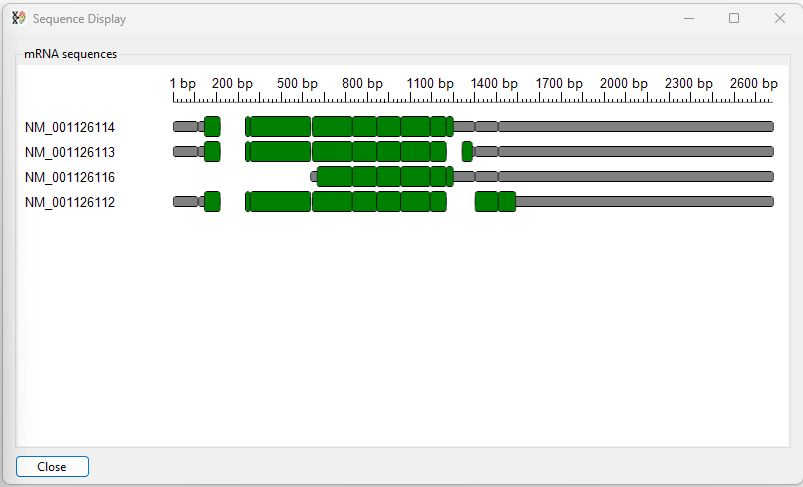

Figure 7b

Figure 7: Transcripts are displayed in the order they appeared in the right-hand list

---

### Renaming a transcript

To change a transcript's display name, select it by either clicking on it in one of the lists or choosing its name in the upper drop down-list (blue line Figure 8a). Once selected, the transcripts display name will appear in the text area below the dropdown list (black line in Figure 8a) - initially the display name is the same as the transcript's GenBank accession ID. To change the display name, delete the current display name in the text area and enter the new name. This should change the text in the Display name column - any changes are automatically stored, but only become permanent if the window is closed by pressing the __Accept__ button (Figure 8b). 

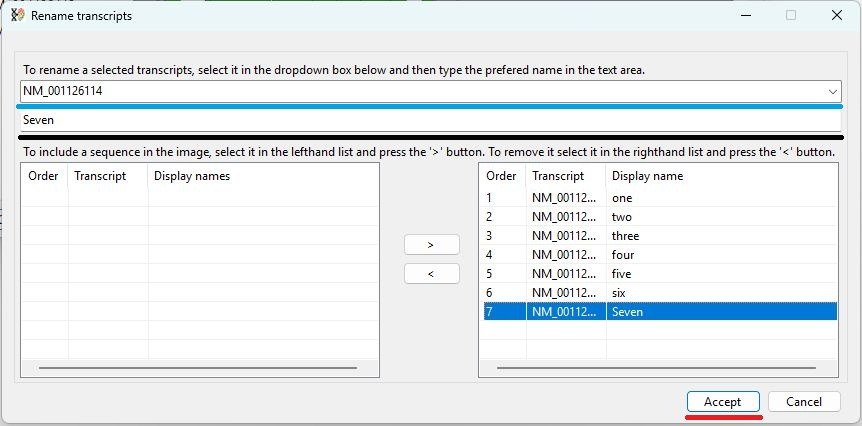

Figure 8a: The display name is changed by selecting the transcript in the drop down list (blue line) and then entering the new name in the text area (black line).

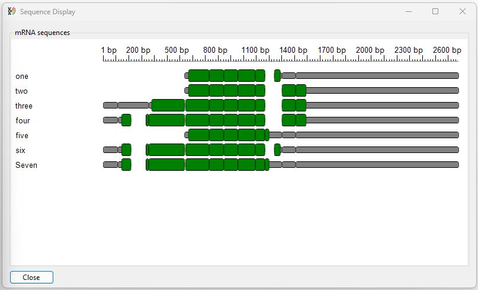

Figure 8b

Figure 8b: Pressing the __Accept__ button (red line in Figure 8a) saves the changes and redraws the image.

---

## Resetting the transcripts display name and order and reselecting omitted transcripts

The display names and transcript order can be reset manually by repeating the process described above. However, if transcripts were previously omitted they will not appear in the lists in the __Rename transcripts__ window. To retrieve these transcripts and reset the order and display names pressing the __Reset__ button (blue line in Figure 9).

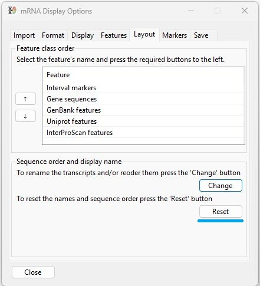

Figure 9: Pressing the __Reset__ button will reset transcript selection and display name.

---