# Manually annotating the transcripts and features

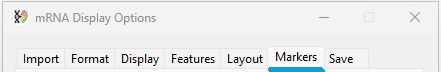

Figure 1: The __Markers__ tab of the ___mRNA Display Options___ window lets you annotate the image with symbols to aid its description (Figure 1).

---

Up to this point, image contains only data that has been imported from curated data sources such the  NCBI GenBank, the UniProt Consortium and EMBL-EBI's InterPro. The user input has been limited to changing the display names and formatting the image. However, the __Markers__ tab allows you to add a range of symbols to aid annotation of the image. These markers are free floating and can be placed anywhere in the image except in the area reserved for the labels. Once a symbol is added to the collection of markers, its top left corner is locked to a base pair position in a user selected data line. This allows the figure to be resized and the order of the transcripts and features to be change with the symbol maintaining its position relative to the selected data line.
The __Markers__ tab also contains controls to permanently add the current symbol to the image or delete it (Figure 2).

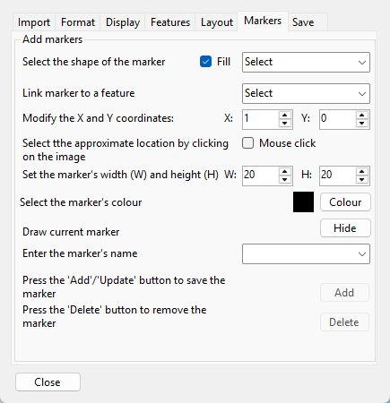

Figure 2: The __Markers__ tab allows you add, modify and delete symbols from the image.

---

## Selecting the marker's shape

The shape of the marker is set using the drop-down list in the top right corner of the __Markers__ tab (blue box in Figure 3a) with the possible shapes shown in Figure 3b. While Figure 3b shows the markers as solid shapes, deselecting the __Fill__ tick box (red line in Figure 3a) only draws the shapes border.

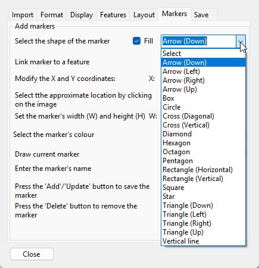

Figure 3a

Figure 3b

Figure 3: The shape of the marker is set using the upper right hand drop-down list (blue box in Figure 3a). The possible shapes are shown in Figure 3b: the __Fill__ option draws the markers as a solid shape (upper row) or the shape's border (lower row). 
  
---

## Selecting the transcript/feature line used to anchor the position of a marker

Since the __Layout__ allows the order of the transcripts and GenBank, UniProt and IntroProScan features to be changed, a markers position is locked relative to the position of a transcript/feature line. This line is selected using the second drop-down list which contains a list of the currently displayed names (blue box in Figure 4).   

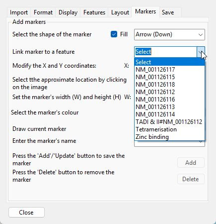

Figure 4: The second drop-down list (blue box) contains a list of the currently displayed line names to which a marker can be anchored.

---

## Setting the position of a marker in the image

While a marker's position is set relative to a transcript/feature line, it can be placed anywhere in the image. However, it is best to anchor a marker to a line to which it is referring to, otherwise if the order of the features is changed its intention may be lost.

The markers position can be set using either the __X__ and __Y__ numeric controls (blue line in Figure 5) or by selecting the __Mouse click__ option (black line in Figure 5) and clicking on the image. ___Note: When drawing graphs the X = 0 and Y = 0 position is normally in the bottom left corner, however, when drawing images this position in the top left corner___ (red circle in Figure 5). This is done as it greatly simplifies redrawing the image when the picture is resized. 
Since the X = 0 and Y = 0 position is in the top left corner, increasing the value of the __Y__ numeric control moves the marker towards the bottom of the image.

Generally speaking, it is easier to place a marker in the approximate location clicking on the image with the  mouse and and placing the marker more accurately using the X, Y numeric controls 

## Displaying a marker

Once the marker's shape, X, Y coordinates and linked data line are selected the marker will be drawn (Figure 5). The marker will be drawn inside a black box to signify it is only temporary, once the marker has been added to the images marker collection the black box will be removed. 

The large green arrow in Figure 5 show the point from which a marker is drawn: the box's top left corner at the selected X,Y coordinates and it is this point that is anchored to the selected transcript/feature line. This may mean the marker is displaced is the width/scale of the image is changed significantly.  

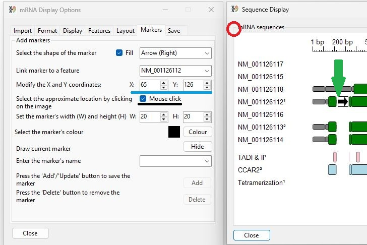

Figure 5: The second drop-down list (blue box) contains a list of the currently displayed line names to which a marker can be anchored.

---

## Adjusting the size of the marker

The __W__ and __H__ numeric controls (blue line in Figures 6a and 6b) set the symbol’s size, with values ranging from 1 to 25. The __W__ and __H__ values can be adjusted independently of each other. When the marker is resized it can be seen that top left corner remains in the same position.

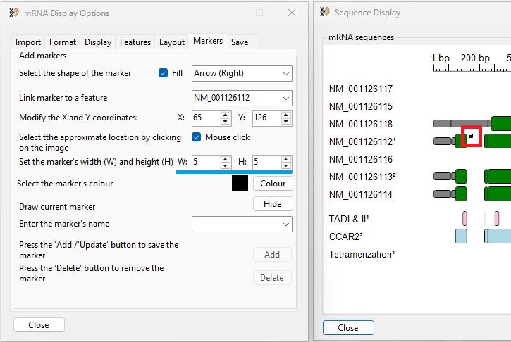

Figure 6a

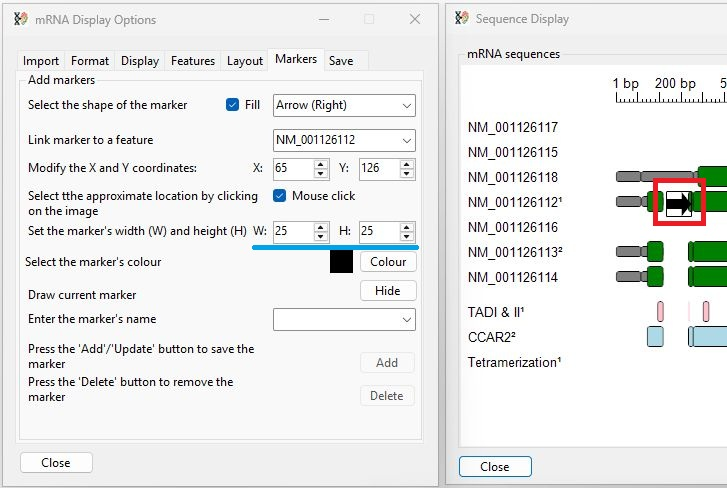

Figure 6b

Figure 6: The marker can be resized (red box in 6a and 6b) using the __W__ and __H__ numeric controls (blue line in 6a and 6b)
  
---

### Selecting the markers colour

To change the colour used to draw the marker is set by pressing the __Colour__ button (blue line in Figure 16). By default, the markers are coloured black. To change their colour press the __Colour__ button (blue line in Figure 7a). This will display a window called  __Feature colour selection__ (Figure 7b). This window allows a colour to be selected by either its Windows system name if the __List of names__ option is selected (black line in Figure 7b) or with the Windows colour picker dialog window if the __Colour dialog box__ option is selected (green line in Figure 7b) and the __Colour__ button is pressed (red line in Figure 7b).

- [Using the Select colour by name dialog](equenceColour.md)
- [Using the Windows colour picker dialog](ColourPickerDialog.md)

The new colour will then be displayed next to the __Colour__ button. Pressing the __Accept__ button will close the window, change the colour used to draw the marker (black box in Figure 16c)

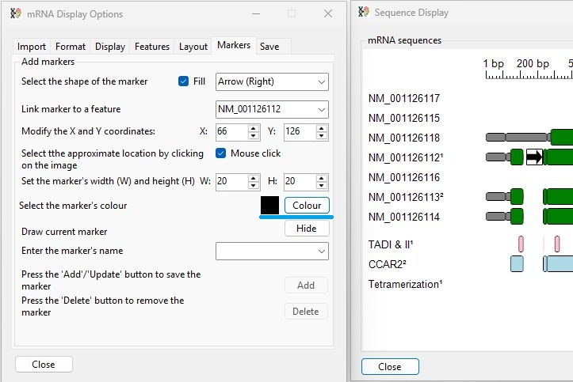

Figure 7a: The colour of markers can be changed by pressing the __Colour__ button (blue line) and selecting the colour using the displayed dialog box (figure 7b).

---

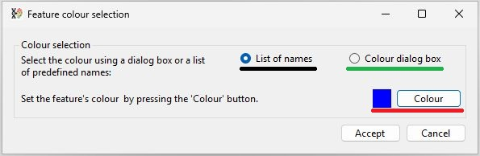

Figure 7b:  Once changed the colour is shown next to the __Colour__ button (red line).

---

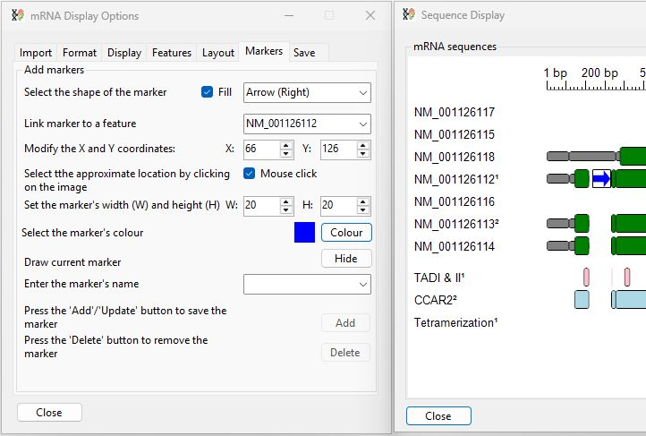

Figure 7c:  When the __Accept__ button in the __Feature colour selection__ window is pressed, the form closes and the marker changes to the selected colour.

---

## Hiding and displaying an unsaved marker

Once marker position, linked sequence and shape has been selected the marker is drawn. To hide a marker you can either set the linked sequence and shape to _Select_ in the appropriate drop-down list or press the __Hide__ button (blue lines in Figure 8a). This will change the buttons label to __ Draw__ and the marker will not be displayed (blue lines in Figure 8b).

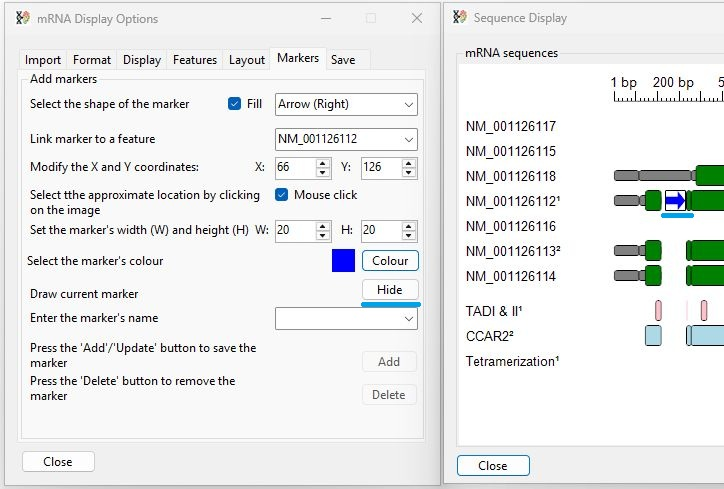

Figure 8a 

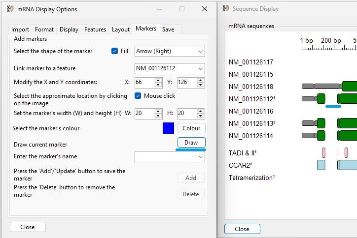

Figure 8b

Figure 8: An unsaved marker can be hidden or displayed by toggling the __Hide__/__Draw__ button (blue lines in Figures 8a and 8b).

---
