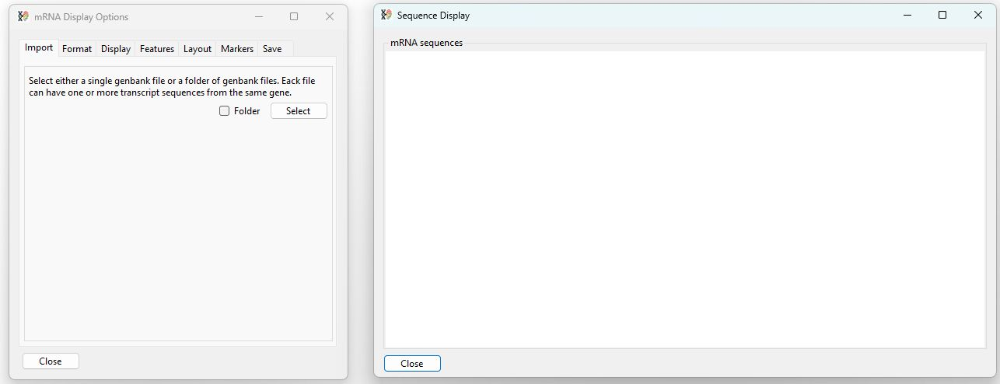

# TransGBViewer Guide

TransGBViewer's user interface consists of two windows: ___mRNA Display Options___ window and the ___Sequence Display___ window (figure 1).

The user interface consists of two windows

The ___mRNA Display Options___ contains controls placed across 7 tab pages that are used to modify the image which is displayed in the ___Sequence Display___. Initially, the  ___Sequence Display___ is blank and the ___mRNA Display Options___ displays the options for importing data.

## Importing sequence data

TransGBViewer is designed to display linear mRNA sequence data downloaded from the NCBI website in the GenBank format with the *.gb or *.genbank file extensions. It is possible to import a single file containing multiple entries or a folder of files that contain one or more entries. It is expected that all the sequences relate to the same gene in a single species.

### Importing data 

The first tab page of the ___mRNA Display Options___ window allows you to select the GenBank formatted sequence data. Pressing the __Select__ button with the __Folder__ option unticked prompts you to select a single file containing multiple entries (Figure2)

Pressing the __Select__ button prompts you to select a single file.

Pressing the __Select__ button with the __Folder__ option ticked prompts you to select a folder of GenBank formatted files each containing one or more entries (Figure2)

Pressing the __Select__ button with __Folder__ option checked prompts you to select a single file.

Once data has been imported, the sequences are 
