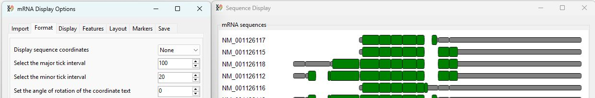

# TransGBViewer Guide

___TransGBViewer's___ user interface consists of two windows: the ___mRNA Display Options___ window and the ___Sequence Display___ window (Figure 1).

Figure 1: The dual windows of ___TransGBViewer___

The ___mRNA Display Options___ contains controls placed across 7 tab pages that are used to modify the image which is displayed in the ___Sequence Display___. Initially, the  ___Sequence Display___ is blank and the ___mRNA Display Options___ displays the options for importing data.

## Importing sequence data

TransGBViewer is designed to display linear mRNA sequence data downloaded from the NCBI website in the GenBank format with the *.gb or *.genbank file extensions. It is possible to import a single file containing multiple entries or a folder of files that contain one or more entries. It is expected that all the sequences relate to the same gene in a single species.

⚠️ <b>Important note: Since the GenBank files do not reference each other, sequence similarities are determined based on their sequence similarity. Consequently, it is important that the sequences are highly homologous and so only sequences from the same species can be used and ideally, sequences submitted by the same group or GenBank's own submission system used to annotated reference genomes.</b> 

### Data selection

The first tab page of the ___mRNA Display Options___ window allows you to select the GenBank formatted sequence data. Pressing the __Select__ button with the __Folder__ option unticked prompts you to select a single file containing multiple entries (Figure 2)

Figure 2: Pressing the __Select__ button prompts you to select a single file, if the __Folder__ option is unchecked.

Pressing the __Select__ button with the __Folder__ option ticked prompts you to select a folder of GenBank formatted files each containing one or more entries (Figure 3)

Figure 3: Pressing the __Select__ button with __Folder__ option checked prompts you to select a single file.

### Image description

Once data has been imported, the sequences are displayed in the  ___Sequence Display___ window (Figure 4).

Figure 3:

The sequences of each transcript are ues to create a consensus sequence of the gene's transcribed sequences. Initially, a transcripts non-coding sequences are drawn as narrow grey rectangles, while coding sequences are drawn as taller green boxes. Sequence's common to a number of transcripts are drawn above each other allowing common sequences to be identified. 
The base pair coordinates of the consensus sequence are displayed above the transcripts, while the labels identifying the transcripts are drawn to the left.

### The Format tab: adjusting the image's format

The __Format__ tab page of the __mRNA Display Options__ window allows you to modify the format of the image by changing the format of the sequence coordinates label (X-axis label), the location and width of the sequence labels, and the size of the gaps representing the location of introns. It is also possible to change the font and font style, but not font size of the font  used to write the labels.

#### Format of the coordinate labels

Figure 3: Pressing the __Select__ button with __Folder__ option checked prompts you to select a single file.

