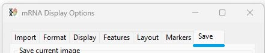
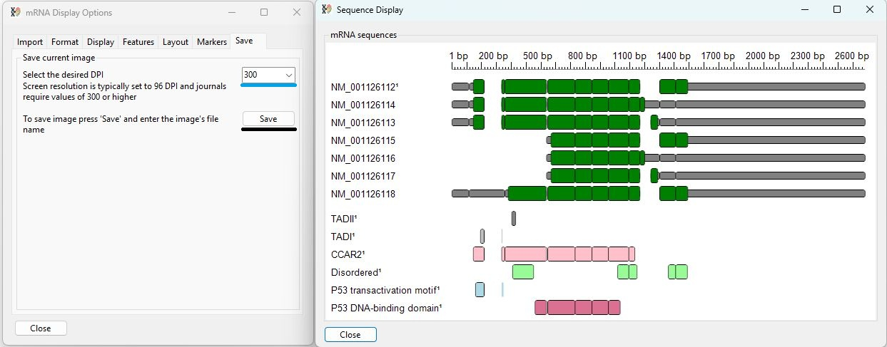
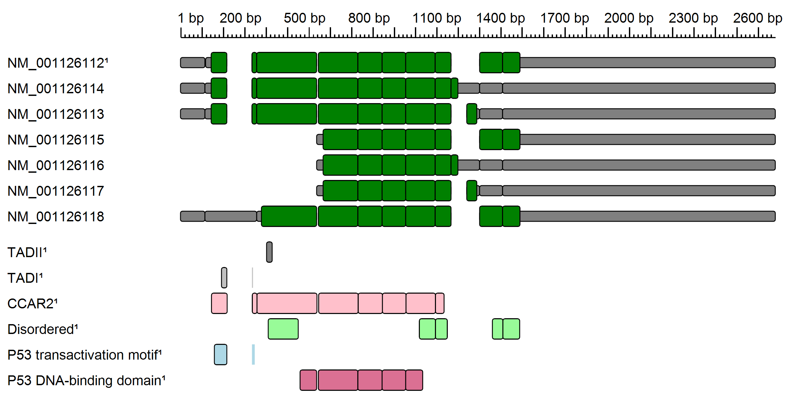

# Saving an image to file

The __Save__ tab of the ___mRNA Display Options___ window allows the image to be saved to a file in a range of DPIs from 96 to 900 DPI (Figure 1).

Figure 2: The DPI of the saved image is set using the dropdown list at the top of the __Save__ Tab (blue line). This allows the DPI to be set at 96, 200, 300, 400, 500, 600, 700, 800, or 900. Pressing the __Save__ button (black line) will prompt you to enter a file name and location before you can save the images as a bitmap, portable graphic, JPEG, or TIFF image file.

Figure 3: An exported image at 300 DPI. This image may look fuzzy, as it has probably been down-sampled by your browser. To appreciate the fine details, download the image and view it in an application like Paint, GIMP, or Photoshop.

