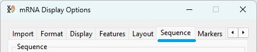
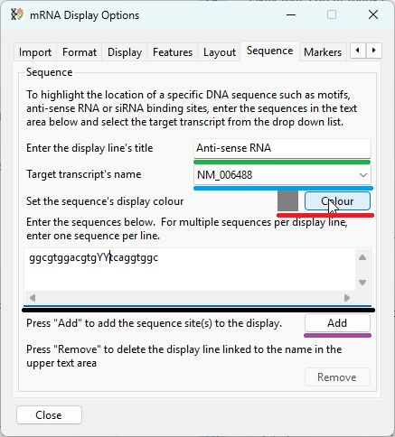
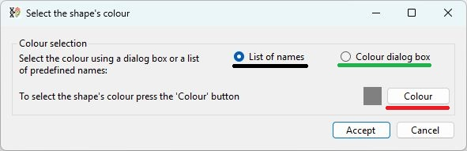
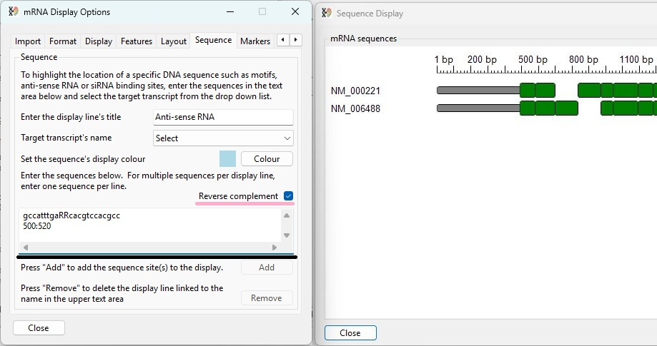
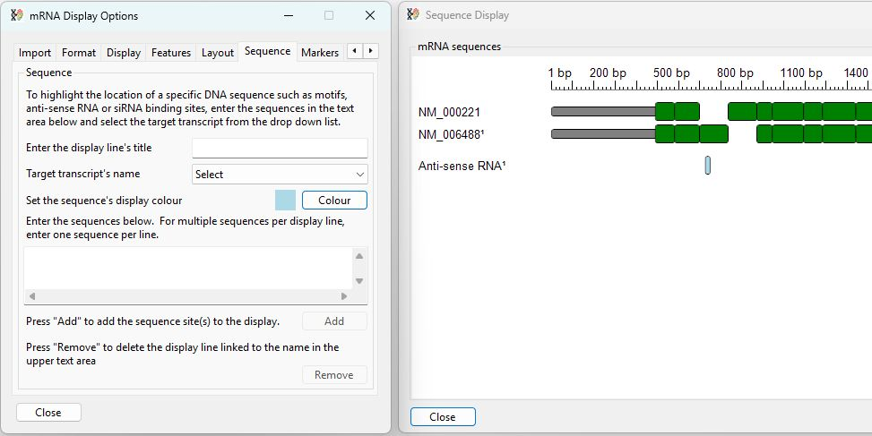
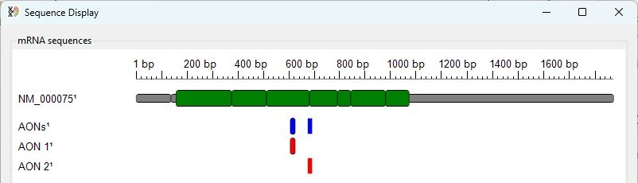

## List of contents
- [Highlighting DNA sequences of interest](#highlighting-dna-sequences-of-interest)
    - [Creating a display line](#creating-a-display-line)
    - [Hit detection](#sequence-hit-detection)
    - [Removing a display line](#removing-a-display-line)
    - [Hit detection](#hit-detection)
---

# Highlighting DNA sequences of interest

## Creating a display line

The __Sequence__ tab of the __mRNA Display Options__ window provides controls for the selection and display of sequences entered by the user. These sequences could represent the target site of an anti-sense RNA, a PCR primer binding site or a region of interest  (Figure 1).

The process by which a line is added to the image that displays the location of a sequence of interest consists of four or five steps. 

Figure 2

---
- First enter the label you wish the data line to display in the upper text area (green line in Figure 2). This label will also be used to identify the line and so must be unique as well as over three characters long. __Note:__  The __'#'__ cannot be used.
- Next, select the accession ID of the sequence you know contains the sequence of interest using the drop-down list (blue line in Figure 2).
- Optional: select the colour used to fill the shape that indicates the location of the sequence by pressing the __Colour__ button (red line in Figure 3).  By default, the shape is grey, as shown by the square to the left of the __Colour__ button. Pressing this button displays a window called __Select the shape's colour__ (Figure 3). This window in turn allows a colour to be selected by either its Windows system name if the __List of names__ option is selected (black line in Figure 12a) or using the Windows __colour picker dialog__ window if the Colour dialog box option is selected (green line in Figure 12) when the Colour button is pressed (red line in Figure 3).   

    - [Using the Select colour by name dialog box](SequenceColour.md)
    - [Using the Windows colour picker dialog box](ColourPickerDialog.md)

Figure 3.

---

- Next, enter the sequence(s) of interest into the lower larger text area (black line in Figure 2). These sequences must be in the same sense as the sequence in the transcript and not its reverse complement; consequently, anti-sense RNA or siRNA sequences must be reverse complemented. See the section [Hit detection](#Hit-detection). If you want to display more than one sequence on a display line, enter each sequence on a new line in the text area.
- Finally, press the __Add__ button (purple line in Figure 2) to import and display the sequences. See Figures 4a and 4b.

Figure 4a: To add a display line, first enter the require information in the __Sequence__ tab.

Figure 4b: Once the information has been entered, pressing the __Add__ button clears the form and displays any hits in the image window.

---

## Removing a display line

To remove a line displaying a sequence's location, enter the display line's label in the upper text area (green line in Figure 5) and the sequence used as the target in the drop-down list (blue line in Figure 5). If these values match a display line, the __Remove__ button will become active, and pressing it will remove the corresponding display line.

__Note:__ The display line's text is case sensitive so __Anti-sense RNA__, __anti-sense RNA__, and __Anti-Sense RNA__ are all different and not interchangeable.

## Hit detection
Important points:

- The search sequence can contain the upper and lower case letters: _A_, _C_, _G_ _T_, _R_, _Y_, _S_ and _W_, but not _U_. 
- If a sequence contains _A_, _C_, _G_ _T_, _R_, _Y_, _S_ and _W_ characters, matches score as  1; for example, if __R__ is aligned to an __A__, the match is scored the same as if __A__ were matched to __A__ (See Table 1). 

|Search term|Matching hits|
|-|-|
|_A_|_A_|
|_C_|_C_|
|_G_|_G_|
|_T_|_T_|
|_R_|_A_ or _G_|
|_Y_|_C_ or _T_|
|_S_|_C_ or _G_|
|_W_|_A_ or _T_|

Table 1: Characters in the search sequence and their matching hit characters in the transcript sequence.

- Only hits in which at least 90% of positions are the same are displayed.
- Only sequences with the best match are displayed. If two locations have the same best score, both will be displayed. If one hit is 100% identical and a 2nd hit is 99% identical, only the first hit will be displayed.

Figure 5a.

---

- If two or more sequences are entered together, they will be drawn on the same line (blue shapes in Figure 5a). If they are entered separately, each sequence will be displayed on its own line (red shapes in Figure 5a).

Figure 5b.

---

- If a sequence spans a splice site and the intron is highlighted as a gap, the shape identifying the hit is drawn as two fragments joined by a line (Figure 5b).