# Displaying features linked to the transcripts by UniProt

The __Protein features from the UniProt website__ panel (Figure 1) contain the controls required to obtain, select, format and display features linked to transcripts by the UniProt website.

The __Protein features from the UniProt website__ panel contains four buttons:
- The __Import__ button allows previously saved feature data from the UniProt website to be reloaded (blue line in Figure 1).
- The __Search__ button allows you to query the UniProt website for features linked to the transcripts (green line in Figure 1).
- The __Save__ button allows you to save the search results from UniProt for later use (red line in Figure 1).
- The __Create__ button allows you to select, format and display features retrieved from a UniProt search (grey line in Figure 1).

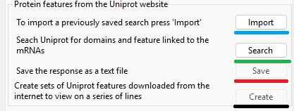

Figure 1: The __Protein features from the UniProt website__ panel (Figure 1) contain the controls required to obtain, select, format and display features linked to the transcripts by the UniProt website as described above.

---

## Retrieving a previously saved search result

Pressing the __Import__ button (blue line in Figure 1) allows you to select a file that contains a previously stored search result that was saved using the __Save__ button (red line in Figure 1). If the data is successfully imported, the __Create__ button (black line in Figure 1) will become active, allowing you to select and format UniProt features ([see Selecting and formatting UniProt features](#selecting-and-formatting-uniprot-features)).

## Searching the UniProt website for features linked to the transcripts

Pressing the __Search__ button (green line in Figure 1) opens the __Domain Search__ window (Figure 2). This window performs the searches, displaying the current search status in the large text area.

When performing the searches, this window will be locked (and __TransGBViewer__ will be unresponsive) while it awaits a response from the websites. 

The search consists of up to four steps:
- If the transcript is linked to a protein ID in the GenBank file, __TransGBViewer__ will use these IDs
- If no protein ID is linked to the transcript, then:
    - Collect the transcript's GenBank accession IDs and retrieve the linked NCBI sequence IDs from the NCBI site. (These are not the GenBank DNA or protein accession IDs).
    - Submit the NCBI sequence IDs to the NCBI to retrieve the linked GenBank protein accession ID.
- Submit the GenBank protein accession IDs to UniProt to start a search and note the search's job ID.
- Request the search results from UniProt using the job ID. If the search has not finished, the process waits 5 seconds before requesting the results.

Since the process may require both the NCBI and UniProt web services to run, it can be slow or fail altogether. When it works, the process is relatively quick; however, high server load at either the NCBI or UniProt may have a considerable impact. If it fails, resubmit the search straight away; if that fails, you may have to wait several hours or even days before it starts to work correctly. Figure 2 shows the feedback from a UniProt domain search.

### Feedback description

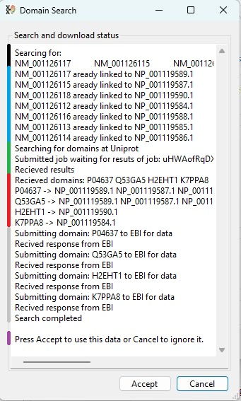

Figure 2: Feedback from the search for UniProt protein data as described below.

---

Description of the feedback text

- The first two lines list the transcript ID that will be used (black line in Figure 2).
- The next block of text indicates that all of the seven transcripts are already linked to a GenBank protein ID found in the original GenBank data file (blue line in Figure 2).
- These GenBank protein IDs are then submitted to UniProt, which gives the task a job ID of "uHWAofRqDX". The UniProt site is then contacted every 5 seconds to request the results. In this case the results were returned on the first request as indicated by the line "Received results". If the search is not complete, the text "Not ready, wait 5 sec before trying again" will appear following each request (green line in Figure 2). 
- The retrieved domains are then listed and linked to the transcripts that contain them (red line in Figure 2).
- The domains are then submitted to the EBI website to request the domain's features (grey line in Figure 2).
- Finally, if successful, the user is instructed to press __Accept__ to accept the data (purple line in Figure 2). 

## Selecting and formatting UniProt features 

To add UniProt data aligned to the transcript sequences, press the __Create__ button, which will open the __Miscellaneous GenBank feature selection__ window (Figure 3).

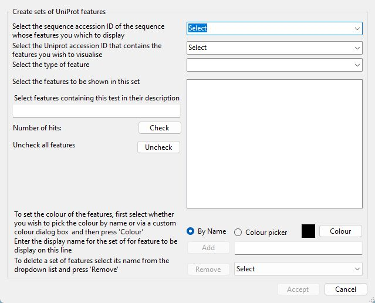

Figure 3: The __Miscellaneous GenBank feature selection__ window.

---

### Selecting a UniProt domain

The UniProt domains may be linked to one or more sequences. Consequently, you must first select a sequence in the first drop-down list (blue line in Figure 4) and then select a UniProt domain linked to the sequence using the second drop-down list box (black box in Figure 4).

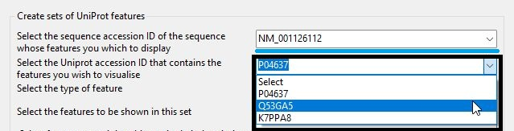

Figure 4: To select a UniProt domain, first select a transcript in the upper drop-down list (blue line) and then select a domain from the second drop-down list (black box).

---

### Selecting a feature type 
Once a domain has been selected, you must then select the type of data you want to select from the third drop-down list box (blue box in Figure 5).

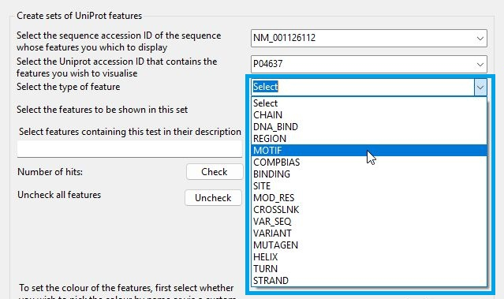

Figure 5: Once a domain has been selected, it is then possible to select the type of feature you wish to display using the third drop-down list (blue box).

---

The large checkbox list area below the feature type drop-down list will then be populated with various features. Some feature types hold only a few entries (Figure 6a), while others may hold so many you need to scroll through the list (Figure 6b). 

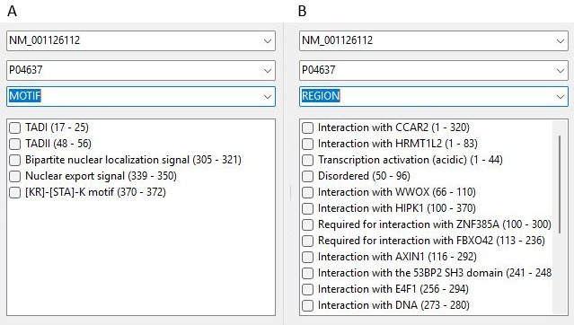

Figure 6: Some feature types contain more entries than others.

---

The size of a feature varies from a single amino acid to the entire protein. To indicate the length and location of a feature its start and end points are listed after its display name in the list; for example, the CCARR2 domain (first entry in Figure 6b) starts at residue 1 and ends at residue 320 with a length of 320 amino acids.

### Selecting one or more features to display on a line

One or more features can be displayed on a single line; to select feature(s) to be displayed on a line, check the box at the side of the entry (figure 7a). If you wish to display multiple features on a line, you can either manually select each feature or enter text in the text area (blue line in Figure 7b) that is present in all the features you wish to display and then press the __Check__ button (black line in Figure 7b) to select all the entries containing the text.

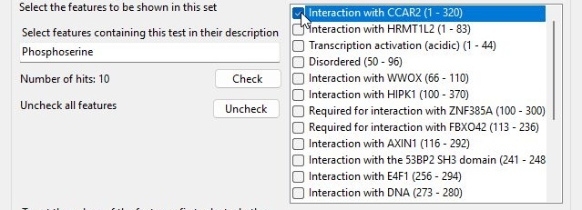

Figure 7a: Features can be manually selected by checking the box next to their name.

---

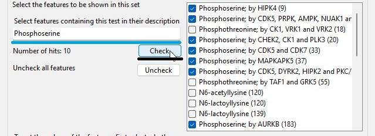

Figure 7b: Multiple features can be selected by entering text in the text area (blue line) that is present in the features of interest and pressing the __Check__ button (black line).

---

### Selecting the colour used to draw the features on a line

Pressing the __Colour__ button (blue line in Figure 7) will display either the  __Select colour by name__ dialog box or the Windows __Colour picker__ dialog box depending on which option is selected (red line in Figure 7). These dialog boxes allow you to select a colour as described here: 

- [Using the Select colour by name dialog box](SequenceColour.md)
- [Using the Windows colour picker dialog box](ColourPickerDialog.md)

Once selected, the area next to the __Colour__ button will be drawn in the selected colour (black line in Figure 7).

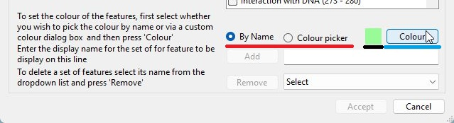

Figure 8: Pressing the __Colour__ button allows you to select the colour of the features.   

---

## Saving the features to be drawn

Once a line's features and colour have been selected, it is saved by entering the line's display name in the text area (blue line in Figure 9) to the right of the __Add__ button (black line in Figure 9). This name will also be used as the line's label in the final image and so must be informative, correctly capitalised and 3 or more letters in length. Entering a name will make the  __Add__ button active, while pressing it will save the line and clear the text area. If the name is already in use the __Add__ button's label will change to __Update__, and pressing it will update/overwrite the previously saved feature row.

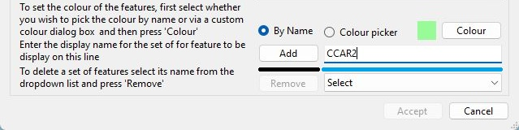

Figure 9: A feature row is saved by entering its display name in the text area (blue line) and pressing __Add__ (black line). 

---

## Removing a line

When a data line has been saved, its name is added to the dropdown list (blue line in Figure 9) to the right of the remove button (black line in Figure 9). A line's name consists of its display name, the domain's ID and the linked sequence's ID in the format \<name\>#\<Domain ID>#\<linked sequence name\>. Selecting a name from the dropdown list and pressing __Remove__ will delete the line.

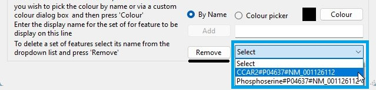

Figure 10: A feature row is removed by selecting its name ("name" + # + "Domain ID" + # + "linked sequence name") in the text area (blue line) and pressing __Remove__ (black line). 

---

## Accepting the feature edits and redrawing the image

Changes to the collection of feature lines are only saved if the __Accept__ button at the bottom of the __Miscellaneous GenBank feature selection__ window is pressed. 

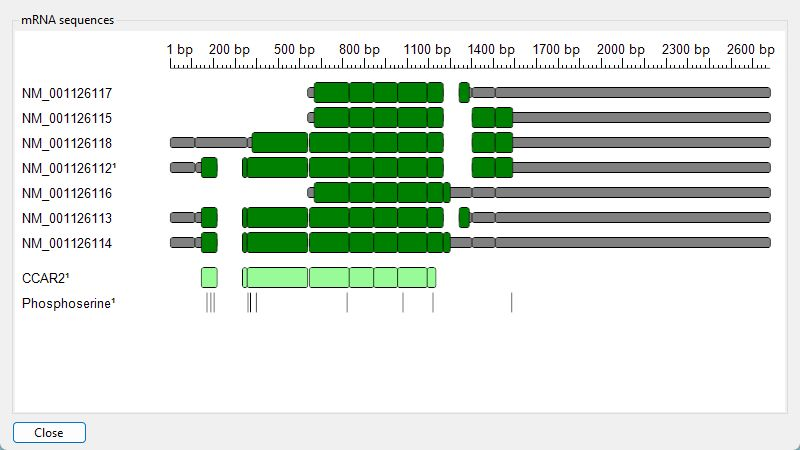

Figure 11: The feature rows are added to the image if the __Accept__ button at the bottom of the __Miscellaneous GenBank feature selection__ window is pressed. 

---