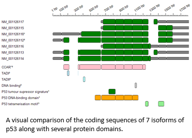

# TransGBViewer

#### Contents
- [Introduction](#Introduction)
- [Guide](Guide)
- [Running on Linux, BSD or macOS](#running-on-linux-bsd-or-macos)
- [Download](Download)

## Introduction

___TransGBViewer___ is designed to aid the visualisation of the different functional domains of a gene's isoforms, enabling the interpretation of transcript diversity at both the sequence and functional levels. 

By comparing a gene's isoforms, it should be possible to understand the different roles of alternatively spliced transcripts. Each isoform potentially encodes a protein with distinct functions, localisations, or regulatory properties. 

Analysing differences between differentially expressed isoforms may reveal their tissue-specific, developmental, and temporal roles, offering insights into a gene’s function in normal and disease physiology.

## Guide

The ___TransGBViewer___ guide is [here:](Guide/README.md)

### Running on Linux, BSD or macOS
___TransGBViewer___ can be run on most non-ARM POSIX-like systems via WINE, whose installation is covered [here](https://github.com/msjimc/RunningWindowsProgramsOnLinux)

## Download

The compiled program can be downloaded from [here.](Download/README.md)
